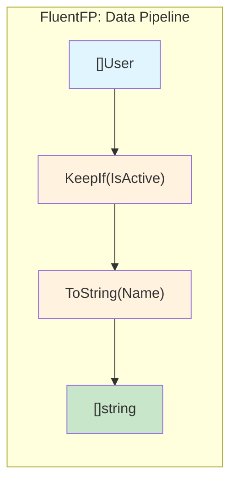
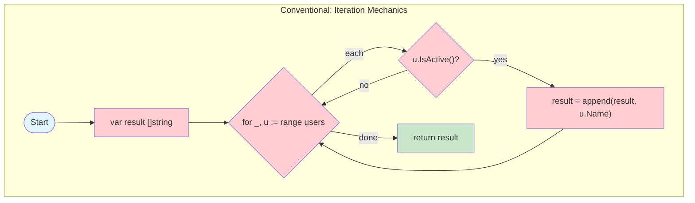
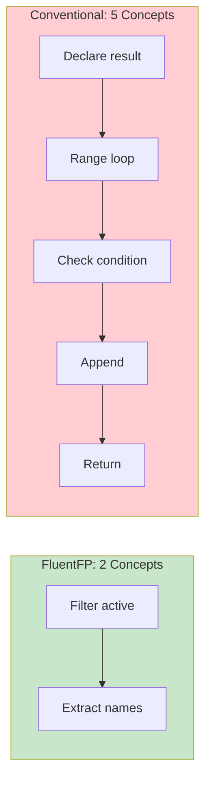
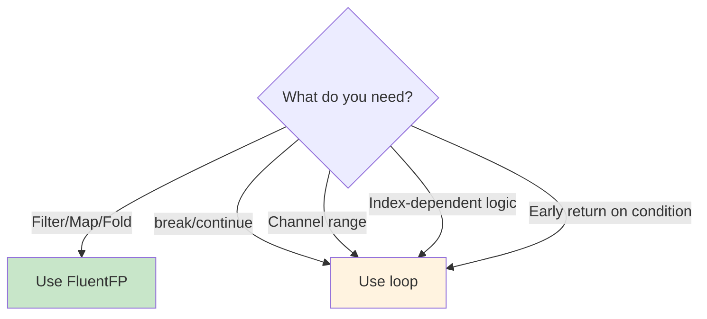

# FluentFP Analysis

FluentFP is a genuine readability improvement for Go. The core insight: **method chaining abstracts iteration mechanics**, letting you read code as a sequence of transformations rather than machine instructions.

## The Core Difference





A loop interleaves 4 concerns—variable declaration, iteration syntax (with discarded `_`), append mechanics, and return. FluentFP collapses these into one expression:

```go
// FluentFP: what you want
names := slice.From(users).KeepIf(User.IsActive).ToString(User.Name)

// Conventional: how to get it
var names []string
for _, u := range users {
    if u.IsActive() {
        names = append(names, u.Name)
    }
}
```

## Mental Load Comparison



## The Invisible Familiarity Discount

A Go developer looks at `for _, t := range tickets { if ... { count++ } }` and "sees" it instantly. But that's pattern recognition from thousands of repetitions, not inherent simplicity.

**The tell:** Show that loop to a non-programmer, then show them `KeepIf(isActive).Len()`. Which one can they parse?

**The real test:** Come back to your own code after 6 months. The loop requires re-simulation ("what is this accumulating? oh, it's counting matches"). The chain states intent directly.

The invisible familiarity discount: a pattern you've seen 10,000 times *feels* simple, but still requires parsing mechanics. This doesn't mean FluentFP is always clearer—conventional loops win in many cases (see "When Not to Use FluentFP" below). But be aware of the discount when comparing. FluentFP expresses intent without mechanics to parse—the simplicity is inherent, not learned.

**Loop syntax variations add ambiguity.** Go's `for` loop has multiple forms: `for i := 0; i < n; i++`, `for i, x := range`, `for _, x := range`, `for i := range`, `for x := range ch`. Each means something different. When reading a loop, you must first identify which form it is before you can understand what it does. FluentFP methods have one form each—`KeepIf` always filters, `ToFloat64` always extracts—no ambiguity to resolve.

## Concerns Factored, Not Eliminated

FluentFP doesn't make iteration disappear—it moves it to one place.

**Your call site:**
```go
return slice.From(history).ToFloat64(Record.GetValue)
```

**What the library does:**
- `make([]float64, len(input))` — allocation
- `for i, t := range input` — iteration with index
- `results[i] = fn(t)` — transformation and assignment
- `return results` — return

The same four concerns exist. The difference: the library handles them once. You handle only what varies—the extraction function.

**The trade-off:**
- **Conventional**: Write mechanics at every call site
- **FluentFP**: Library writes mechanics once; you write only what varies

## Method Expressions: The Cleanest Chains

The preference hierarchy: **method expressions → named functions → inline lambdas**.

```go
// Best: method expressions read as English
slice.From(developers).KeepIf(Developer.IsIdle)
slice.From(history).ToFloat64(Record.GetLeadTime)

// Good: named function documents intent
// completedAfterCutoff returns true if ticket was completed after the cutoff tick.
completedAfterCutoff := func(t Ticket) bool { return t.CompletedTick >= cutoff }
slice.From(tickets).KeepIf(completedAfterCutoff).Len()
```

When you write `users.KeepIf(User.IsActive).ToString(User.Name)`, there's no function body to parse—it reads like English.

**Critical requirement:** Method expressions require value receivers. `slice.From(users)` creates `Mapper[User]`, so `User.IsActive` must have receiver type `User`, not `*User`.

## Quantified Benefits

| Pattern | FluentFP | Conventional | Reduction |
|---------|----------|--------------|-----------|
| Filter + return | 1 line | 7 lines | 86% |
| Filter + count | 3 lines | 7 lines | 57% |
| Field extraction | 1 line | 5 lines | 80% |
| Fold/reduce | 2 lines | 4 lines | 50% |

## Real Patterns

### Filter + Count
```go
// FluentFP
openCount := slice.From(incidents).KeepIf(Incident.IsOpen).Len()

// Conventional
// Count open incidents
count := 0
for _, inc := range incidents {
    if inc.IsOpen() {
        count++
    }
}
```

### Field Extraction (Map)
```go
// FluentFP with method expression
values := slice.From(history).ToFloat64(Snapshot.GetPercent)

// FluentFP with named function (when no method exists)
// getPercent extracts the Percent field from a Snapshot.
getPercent := func(s Snapshot) float64 { return s.Percent }
values := slice.From(history).ToFloat64(getPercent)

// Conventional
// Extract percent values from history
values := make([]float64, len(history))
for i, s := range history {
    values[i] = s.Percent
}
```

### Fold (Reduce)
```go
// FluentFP with named reducer
// sumDuration adds two durations.
sumDuration := func(a, b time.Duration) time.Duration { return a + b }
total := slice.Fold(durations, time.Duration(0), sumDuration)

// Conventional
// Sum all durations
var total time.Duration
for _, d := range durations {
    total += d
}
```

## Why Named Functions Matter

Anonymous lambdas in chains force you to parse:
1. Higher-order syntax (`func(x Type) bool { ... }`)
2. Predicate logic (the condition inside)
3. Chain context (what comes before/after)

A named function like `completedAfterCutoff` lets you skip the first two and read intent directly. Naming also aids your own understanding—articulating what a predicate does crystallizes your thinking.

## Design Decisions

**Interoperability is frictionless.** FluentFP slices auto-convert to native slices and back. Pass them to standard library functions, range over them, index them. Use FluentFP for one transformation in an otherwise imperative function without ceremony.

**Bounded API surface.** Each package solves specific patterns cleanly:
- `slice`: KeepIf, RemoveIf, Convert, ToX, Each, Fold—no FlatMap/GroupBy sprawl
- `option`: Of, Get, Or—no monadic bind chains
- `must`: Get, BeNil, Of—three functions
- `ternary`: If, Then, Else

The restraint is deliberate: solve patterns cleanly without becoming a framework.

**Works with Go's type system.** Generics are used minimally—`Mapper[T]` and `MapperTo[R, T]` are the extent of it. No reflection, no `any` abuse, no code generation. Type safety is preserved throughout.

## When Not to Use FluentFP



1. **Channel consumption** - `for r := range ch` has no FP equivalent
2. **Complex control flow** - break, continue, early return within iteration
3. **Index-dependent logic** - when you need `i` for more than just indexing

These aren't failures of functional style—they're cases where imperative control flow is genuinely clearer.
