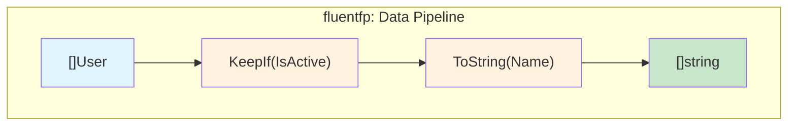
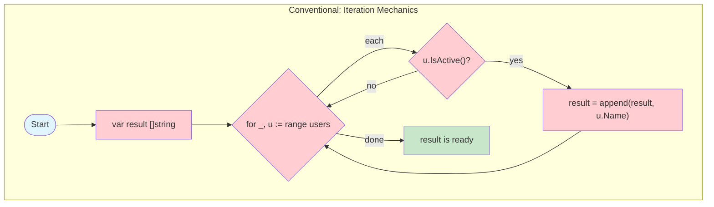
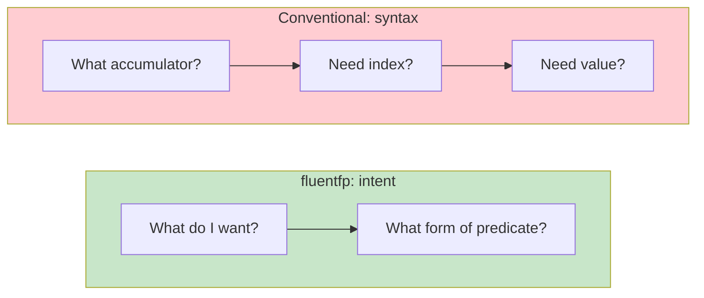
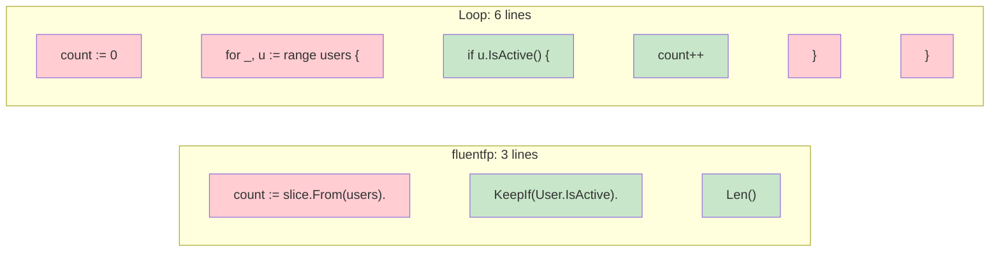
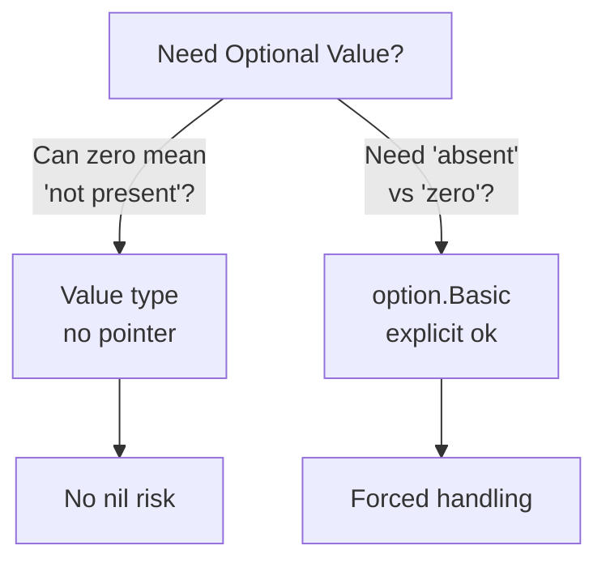

# fluentfp Analysis

fluentfp is a genuine readability improvement for Go. The core insight: **method chaining abstracts iteration mechanics**, letting you read code as a sequence of transformations rather than machine instructions.

## The Core Difference

Both approaches filter active users and extract their names. Compare how each represents the same operation:





*Top: data flows linearly through transformations. Bottom: control flow branches and loops back. The shape reflects the mental model—pipeline vs. state machine.*

A loop interleaves 4 concerns—variable declaration, iteration syntax, condition, and accumulation. fluentfp collapses these into one expression:

```go
// fluentfp: what you want
names := slice.From(users).
    KeepIf(User.IsActive).
    ToString(User.Name)

// Conventional: how to get it
var names []string
for _, u := range users {
    if u.IsActive() {
        names = append(names, u.Name)
    }
}
```

## Mental Load Comparison

Complexity has two dimensions: **concepts** (what you need to know) and **decisions** (choices you make each time).

| Dimension | Conventional | fluentfp |
|-----------|--------------|----------|
| **Concepts** | 4 intertwined concerns ([The Core Difference](#the-core-difference)) | 5 operations, predicate forms ([Choice of Function Arguments](#choice-of-function-arguments-for-higher-order-functions)) |
| **Decisions per use** | 2-3 within concerns (accumulator, range form) | 1-2 (operation, predicate form) |
| **Decision type** | Syntax: "which form gives me what I need?" | Intent: "what operation expresses my goal?" |



**Applicability:** In a production codebase (608 loops), 33-41% were fluentfp-replaceable. The rest required complex control flow, I/O streaming, or were Go idioms (table-driven tests).

**For replaceable patterns**, conventional loops require boilerplate (variable declaration, append/increment) while fluentfp requires none:

```go
// Conventional: syntax decisions + boilerplate
count := 0
for _, u := range users {
    if u.IsActive() {
        count++
    }
}

// fluentfp: intent decision, no boilerplate
count := slice.From(users).
    KeepIf(User.IsActive).
    Len()
```

## The Invisible Familiarity Discount

An experienced Go developer looks at `for _, t := range tickets { if ... { count++ } }` and "sees" it instantly. But that's pattern recognition from thousands of repetitions, not inherent simplicity.

**The tell:** Show that loop to a non-programmer, then show them `KeepIf(isActive).Len()`. Which one can they parse?

**The real test:** Come back to your own code after 6 months. The loop requires re-simulation ("what is this accumulating? oh, it's counting matches"). The fluent method chain version states intent directly.

The invisible familiarity discount: a pattern you've seen 10,000 times *feels* simple, but still requires parsing mechanics. This doesn't mean fluentfp is always clearer—conventional loops win in many cases (see "When Not to Use fluentfp" below). But be aware of the discount when comparing. fluentfp expresses intent without mechanics to parse—the "simplicity" is intrinsic, not the result of repeated exposure.

## Concerns Factored, Not Eliminated

fluentfp doesn't make iteration disappear—it moves it into the library.

**Your call site:**
```go
return slice.From(history).ToFloat64(Record.GetValue)
```

**What the library does:**
- `make([]float64, len(input))` — allocation
- `for i, t := range input` — iteration with index
- `results[i] = fn(t)` — transformation and assignment
- `return results` — return

The same four concerns exist. The difference: the library handles them in one place, not every call site. You handle only what varies—the extraction function.

**The trade-off:**
- **Conventional**: Write mechanics at every call site
- **fluentfp**: Library writes mechanics once; you write only what varies

## Choice of Function Arguments for Higher-Order Functions

Takeaway: [Method Expressions](https://go.dev/ref/spec#Method_expressions) give the cleanest chain invocations.

A method expression references a method through its type rather than an instance. These two statements are equivalent:

```go
user.IsActive()      // method call on instance
User.IsActive(user)  // method expression - same result

// The payoff: User.IsActive is a function value you can pass directly
slice.From(users).KeepIf(User.IsActive)
```

No extra syntax required—method expressions come free with every method you define.

The preference hierarchy: **method expressions → named functions**.  Inline lambdas also work, but are discouraged.

```go
// Best: method expressions read as English
slice.From(history).ToFloat64(Record.GetLeadTime)

// Good: named function documents intent
// isAdult returns true if user is 18+ and has an active account.
isAdult := func(u User) bool { return u.Age >= 18 && u.IsActive() }
slice.From(users).
    KeepIf(isAdult).
    Len()

// Avoid: inline lambda requires parsing function syntax mid-chain
slice.From(users).
    KeepIf(func(u User) bool { return u.Age >= 18 && u.IsActive() }).
    Len()
```

**Method expression pre-req:** To use the better-reading method expressions, you must be using a struct with value receivers. `slice.From(users)` creates `Mapper[User]`, so `User.IsActive` must have a value-typed receiver.

## Quantified Benefits

Line counts include comment lines where I consider them essential for clarity.

| Pattern                | fluentfp  | Conventional |
| ---------------------- | --------- | ------------ |
| Filter + Return        | 1 line    | 7 lines      |
| Filter + Count         | 3 lines   | 7 lines      |
| Field Extraction (Map) | 1-3 lines | 5 lines      |
| Fold (Reduce)          | 3 lines   | 5 lines      |

## Information Density

**"As readable and as much code as I can fit on the page."**

Line counts tell part of the story. Information density tells the rest: how much of each line conveys *intent* versus *mechanics*.

**Semantic lines** express domain intent:
- Condition checks (`if u.IsActive()`)
- Accumulation (`count++`, `result = append(...)`)
- Operations (`KeepIf`, `ToFloat64`, `Len`)

**Syntactic lines** exist for language mechanics:
- Variable declarations (`count := 0`, `var result []T`)
- Loop headers (`for _, u := range users {`)
- Closing braces (`}`)

### Filter + Count: Line-by-Line Analysis



**Legend:** 🟩 Green = semantic (intent) | 🟥 Red = syntactic (mechanics)

The fluent version reduces syntactic (red) lines from four to one.

**Loop version** (6 lines):
```go
count := 0                    // syntactic: setup
for _, u := range users {     // syntactic: iteration header
    if u.IsActive() {         // SEMANTIC: condition
        count++               // SEMANTIC: accumulation
    }                         // syntactic: brace
}                             // syntactic: brace
```

**fluentfp version** (3 lines):
```go
count := slice.From(users).   // syntactic: setup
    KeepIf(User.IsActive).    // SEMANTIC: condition
    Len()                     // SEMANTIC: count
```

| Metric | Loop | fluentfp |
|--------|------|----------|
| Total lines | 6 | 3 |
| Semantic lines | 2 | 2 |
| Syntactic lines | 4 | 1 |
| **Semantic density** | **33%** | **67%** |

Same semantic content. Half the lines. Double the density.

### Visual Comparison

**Experiment:** Render the same program in both styles at thumbnail scale—too small to read, but large enough to see the shape.


*Left: Conventional loops (116 lines). Right: fluentfp (108 lines). Source: [examples/code-shape](examples/code-shape).*

**Result:** The line difference was about half what we expected, but 8/108 = 7.4%. A reasonable-sized enterprise Go project might run 500 kloc, for example.  Applied to a 500 kloc codebase: ~37 kloc saved. Thirty-seven thousand lines.

**Why:** The 64% of code that *should* stay as loops (i.e. doesn't fall into a fluentfp pattern) is identical in both versions. These seven functions dominate the silhouette. The 36% that converts (functions 1-4) does shrink dramatically—but that improvement is visually swamped by the unchanging majority.  This was an intentional part of the experimental design, to reflect real-world code effects.  36% was determined by analyzing a real codebase for fluentfp opportunities.

**What this reveals:** fluentfp's value isn't about code shape—it's about error surface. We wish this one were a bigger win, perhaps, but it remains to be seen what more use with real codebases will tell on this metric.

### The Brace Tax

Loops pay a "brace tax"—closing braces consume lines without conveying intent:
- Closing brace for if block: 1 line
- Closing brace for loop body: 1 line
- Nested conditions: more braces

In the example above, 2 of 6 lines (33%) are just `}`. fluentfp has no brace tax.

### Empirical Data

Analysis of 11 representative loops from a production Go codebase (608 total loops):

| Metric | Value |
|--------|-------|
| Average semantic density | 36% |
| Simple transforms (map/filter/reduce) | 33% |
| Braces as % of loop lines | 26% |
| Combined overhead (braces + setup) | 39% |

**Key finding**: Simple transforms—exactly what fluentfp targets—waste 67% of lines on syntax.

> **Methodology**: Lines classified as semantic if they express domain intent (conditions, operations, accumulation). Lines classified as syntactic if they exist purely for language mechanics (declarations, iteration headers, braces). Assignment lines (`x :=`) treated as syntactic on both sides for consistency.

## Real Patterns

### Filter + Return
```go
// fluentfp
actives := slice.From(users).KeepIf(User.IsActive)

// Conventional
// Filter to active users
var actives []User
for _, u := range users {
    if u.IsActive() {
        actives = append(actives, u)
    }
}
```

### Filter + Count
```go
// fluentfp
openCount := slice.From(incidents).
    KeepIf(Incident.IsOpen).
    Len()

// Conventional
// Count open incidents
count := 0
for _, inc := range incidents {
    if inc.IsOpen() {
        count++
    }
}
```

### Field Extraction (Map)
```go
// fluentfp with method expression
values := slice.From(history).ToFloat64(Snapshot.GetPercent)

// fluentfp with named function (when no method exists)
// getPercent extracts the Percent field from a Snapshot.
getPercent := func(s Snapshot) float64 { return s.Percent }
values := slice.From(history).ToFloat64(getPercent)

// Conventional
// Extract percent values from history
values := make([]float64, len(history))
for i, s := range history {
    values[i] = s.Percent
}
```

### Fold (Reduce)
```go
// fluentfp with named reducer
// sumDuration adds two durations.
sumDuration := func(a, b time.Duration) time.Duration { return a + b }
total := slice.Fold(durations, time.Duration(0), sumDuration)

// Conventional
// Sum all durations
var total time.Duration
for _, d := range durations {
    total += d
}
```

## Correctness by Construction

Line counts don't capture bugs avoided. These bugs are from production Go code—all compiled, all passed code review.

| Bug Pattern                        | Why Subtle               | fluentfp Eliminates? |
| ---------------------------------- | ------------------------ | -------------------- |
| Index usage typo (`i+i` not `i+1`) | Looks intentional        | ✓ No index           |
| Defer in loop                      | Defers pile up silently  | ✓ No loop body       |
| Error shadowing (`:=` vs `=`)      | Normal Go syntax         | ✓ No local variables |
| Input slice mutation               | No hint function mutates | ✓ Returns new slice  |

**Error shadowing (`:=` vs `=`):**
```go
// BUG: err is local to loop, outer err unchanged
func ProcessItems(items []Item) {
    for _, item := range items {
        _, err := process(item)  // := shadows outer err
        if err != nil { log.Print(err) }
    }
    // returns nil even if errors occurred
}
```

**Defer in loop:**
```go
// BUG: all Close() calls wait until function returns
for _, id := range ids {
    conn, _ := client.OpenConnection(id)
    defer conn.Close()  // N defers pile up
}
// N connections held until here
```

These bugs compile, pass review, and look correct. They don't exist in fluentfp code because the mechanics that contain them don't exist—no index to typo, no loop body to defer in, no local variable to shadow.

**Note on linters:** Some of these bugs (like defer in loop) can be caught by static analysis tools. But linters require running, configuring, and acting on warnings. fluentfp is correctness by construction—the bug isn't caught, it's unwritable.

## Why Named Functions Matter

Anonymous lambdas in chains force you to parse:
1. Higher-order syntax (`func(x Type) bool { ... }`)
2. Predicate logic (the condition inside)
3. Chain context (what comes before/after)

A named function like `completedAfterCutoff` lets you skip the first two and read intent directly. Naming also aids your own understanding—articulating what a predicate does crystallizes your thinking.

## Design Decisions

**Interoperability is frictionless.** fluentfp slices auto-convert to native slices and back. Pass them to standard library functions, range over them, index them. Use fluentfp for one transformation in an otherwise imperative function without ceremony.

**Bounded API surface.** Each package solves specific patterns cleanly:
- `slice`: KeepIf, RemoveIf, Convert, ToX, Each, Fold—no FlatMap/GroupBy sprawl
- `option`: Of, Get, Or—no monadic bind chains
- `must`: Get, BeNil, Of—three functions
- `ternary`: If, Then, Else

The restraint is deliberate: solve patterns cleanly without becoming a framework.

**Works with Go's type system.** Generics are used minimally—`Mapper[T]` and `MapperTo[R, T]` are the extent of it. No reflection, no `any` abuse, no code generation. Type safety is preserved throughout.

## When Not to Use fluentfp


1. **Channel consumption** - `for r := range ch` has no FP equivalent
2. **Complex control flow** - break, continue, early return within iteration
3. **Index-dependent logic** - when you need `i` for more than just indexing

These are intentional boundaries. The patterns above—index arithmetic, early exits, mutation during iteration—are common sources of off-by-one errors, missed elements, and subtle bugs. Functional programming avoids them on principle. Use them when necessary. For the patterns we've identified, the for loop is neither the clearest nor the safest choice.

## The Billion-Dollar Mistake

In 2009, Tony Hoare—recipient of the 1980 Turing Award for his contributions to programming languages—gave a talk at QCon titled "Null References: The Billion Dollar Mistake." His confession:

> I call it my billion-dollar mistake. It was the invention of the null reference in 1965. At that time, I was designing the first comprehensive type system for references in an object oriented language (ALGOL W). My goal was to ensure that all use of references should be absolutely safe, with checking performed automatically by the compiler. But I couldn't resist the temptation to put in a null reference, simply because it was so easy to implement. This has led to innumerable errors, vulnerabilities, and system crashes, which have probably caused a billion dollars of pain and damage in the last forty years.
>
> — Tony Hoare, QCon 2009 ([InfoQ](https://www.infoq.com/presentations/Null-References-The-Billion-Dollar-Mistake-Tony-Hoare/))

The phrase "simply because it was so easy to implement" is telling. A colleague who worked with Hoare described his approach: "Tony has an amazing intuition for seeking a simple and elegant way of attacking problems" (Bill Roscoe, [FACS FACTS 2024](https://www.bcs.org/media/1wrosrpv/facs-jul24.pdf)). This intuition produced Quicksort, Hoare logic, and CSP. But with null references, simplicity backfired—the easy implementation created forty years of crashes.

Hoare's friend Edsger Dijkstra saw the problem early: "If you have a null reference, then every bachelor who you represent in your object structure will seem to be married polyamorously to the same person Null." The type system lies—it claims a reference points to a User, but it might point to nothing.

### Go's Nil Problem

Go inherited this mistake as `nil`. Pointers serve as "pseudo-options" where `nil` means "not present":

```go
// Conventional: pointer as pseudo-option
func FindUser(id string) *User {
    // returns nil if not found
}

// Caller must remember to check
user := FindUser("123")
if user != nil {          // Easy to forget
    fmt.Println(user.Name) // Panic if nil
}
```

The compiler doesn't enforce the nil check. Every pointer dereference is a potential panic waiting for the right input.

### Two Defenses

fluentfp addresses nil through two complementary strategies:

**1. Value Semantics (First Line of Defense)**

Avoid pointers where possible. No pointer means no nil:

```go
// Value type: no nil possible
type User struct {
    Name  string
    Email string
}

func GetUser() User {
    return User{Name: "default"}  // Always valid
}
```

fluentfp encourages value receivers over pointer receivers. The README states: "Pointer receivers carry costs: nil receiver panics and mutation at a distance. At scale, these become maintenance burdens."

**2. Option Types (When Optionality Is Genuine)**

When you genuinely need to distinguish "absent" from "present," use an explicit container:

```go
import "github.com/binaryphile/fluentfp/option"

// Option type: explicit optionality
func FindUser(id string) option.Basic[User] {
    if found {
        return option.Of(user)      // Present
    }
    return option.NotOk[User]()     // Absent (not nil!)
}

// Caller is forced to handle both cases
userOpt := FindUser("123")
if user, ok := userOpt.Get(); ok {
    fmt.Println(user.Name)
}
// Or with default:
user := userOpt.Or(defaultUser)
```

The API names are intuitive:
- **Creation**: `Of` (always ok), `New` (conditional), `IfProvided` (ok if non-zero), `FromOpt` (from pointer)
- **Extraction**: `Get()` (comma-ok), `Or()` (with default), `OrZero()`, `OrFalse()`, `MustGet()` (panic if not ok)

### Choosing the Right Defense



*If an empty string or zero is a valid value distinct from "no value," use `option.Basic`. Otherwise, value types eliminate nil risk entirely.*

### Real-World Pattern

From a real project, handling nullable database fields:

```go
// Database field might be NULL
type Device struct {
    NullableHost sql.NullString
}

// Convert to option at the boundary
func (d Device) GetHostOption() option.String {
    return option.IfProvided(d.NullableHost.String)
}

// Downstream code works with options, not nil
hosts := slice.From(devices).ToString(Device.GetHostOption().Or(""))
```

Domain option types can propagate "not-ok" through call chains:

```go
type DeviceOption struct {
    option.Basic[Device]
}

func (o DeviceOption) GetHost() option.String {
    device, ok := o.Get()
    if !ok {
        return option.String{}  // Propagates not-ok
    }
    return device.GetHostOption()
}
```

No nil checks in consumer code. If the device doesn't exist, downstream gets a not-ok option—no panic, no crash.

### The Structural Guarantee

The key insight: `option.Basic[T]` is a struct containing a value and a boolean flag—both value types. The zero value is automatically "not-ok" because the boolean defaults to false.

| Approach | Risk | Cost |
|----------|------|------|
| `*T` (pointer) | Nil dereference panic | Every caller must check `if ptr != nil` |
| `option.Basic[T]` | None—no nil possible | Must use `Get()`, `Or()`, or `MustGet()` |

There's no nil to check because there's no nil. The boolean `ok` flag replaces the entire category of nil-related bugs. This is correctness by construction—the same principle that makes `KeepIf` safer than a filter loop. You can't forget to initialize, use the wrong index, or dereference nil, because the structure of the code makes those errors impossible.

## Appendix: Methodology

This appendix documents how empirical claims in the Information Density section were derived, enabling readers to verify or replicate the analysis.

**Contents:**
- [A. Loop Sampling Methodology](#a-loop-sampling-methodology)
- [B. Line Classification Rules](#b-line-classification-rules)
- [C. Density Calculation](#c-density-calculation)
- [D. Replication Guide](#d-replication-guide)
- [E. Limitations](#e-limitations)

### A. Loop Sampling Methodology

How 11 representative loops were selected from a production codebase (608 total):

**What counts as "a loop":**
- Each `for` statement = 1 loop (nested loops count separately)
- `for range`, `for i := 0; ...`, and `for { ... }` all count
- Excluded: test files (table-driven tests skew toward simple patterns)

**Selection approach:**
- Systematic sample: every ~55th loop (608 ÷ 11 ≈ 55)
- Starting point chosen randomly
- No cherry-picking or exclusions after selection

**Source:** Analysis performed on an internal production Go project (~15k LOC excluding tests).

### B. Line Classification Rules

Explicit rules for semantic vs syntactic classification:

**Semantic (intent-carrying):**
- Condition expressions: `if x.IsActive()`, `switch`, `case`
- Accumulation statements: `count++`, `result = append(...)`, `total += x`
- Function calls that do work: `process(item)`, `db.Save(record)`
- Return statements with values: `return result`

**Syntactic (mechanics-only):**
- Variable declarations: `var x T`, `x := 0`, `x := make(...)`
- Loop headers: `for _, x := range xs {`, `for i := 0; i < n; i++ {`
- Closing braces: `}` (standalone line)
- Blank lines within loop body
- Comments (don't count toward either)

**Edge cases (judgment calls—reasonable people may differ):**
- `if x.IsActive() {` — semantic (condition is the point; brace is incidental)
- `x := slice.From(xs).` — syntactic (setup/scaffolding)
- `return nil` — we classify as syntactic (no semantic payload), but could argue either way
- `return result` — semantic (delivers computed value)
- `err != nil` checks — syntactic (error handling boilerplate), though essential

**Guiding principle:** If the line would disappear in a pseudocode version, it's syntactic. If it carries domain meaning, it's semantic.

### C. Density Calculation

**Formula:**
```
Semantic Density = Semantic Lines / Total Lines × 100%
```

**Worked example (filter + count):**

Loop version:
```
Total lines: 6
Semantic: 2 (condition, accumulation)
Syntactic: 4 (setup, header, 2 braces)
Density: 2/6 = 33%
```

fluentfp version:
```
Total lines: 3
Semantic: 2 (KeepIf, Len)
Syntactic: 1 (setup line)
Density: 2/3 = 67%
```

### D. Replication Guide

How readers can verify on their own codebase:

1. **Count loops** (excluding tests):
   ```bash
   grep -rn "^\s*for\s" --include="*.go" --exclude="*_test.go" . | wc -l
   ```
   This catches all forms: `for range`, `for i := ...`, `for condition {`, and `for {`.

2. **Sample systematically**: For N loops, take every (N ÷ 10)th loop. Random start point.

3. **For each sampled loop**:
   - Count total lines (from `for` to closing `}`)
   - Count *visual* lines as displayed, not logical statements
   - Multi-line statements: each line counts separately
   - Mark each line semantic or syntactic per Section B rules
   - Calculate: semantic ÷ total × 100

**Multi-line example:**
```go
result := slice.From(users).    // line 1: syntactic (setup)
    KeepIf(User.IsActive).      // line 2: SEMANTIC (filter)
    ToString(User.Name)         // line 3: SEMANTIC (map)
```
This is 3 visual lines: 1 syntactic + 2 semantic = 67% density.

4. **Aggregate**: Average across all sampled loops

**Expected results for typical Go codebases:**
- Simple transforms: 30-40% semantic density
- Complex control flow: 40-60% semantic density
- Overall average: 35-45% semantic density

Results outside these ranges aren't wrong—they may indicate different coding styles or domain characteristics.

### E. Limitations

**What this metric measures:**
- Vertical space efficiency (lines consumed per unit of intent)
- Proportion of "meaningful" vs "mechanical" code

**What this metric does NOT measure:**
- Readability (dense code isn't always clearer)
- Correctness (fewer lines doesn't mean fewer bugs—though see [Correctness by Construction](#correctness-by-construction) for how fluentfp eliminates certain bug classes)
- Performance (no runtime implications)
- Maintainability (though reduced boilerplate can help)

**Caveats:**
- Classification involves judgment calls; different analysts may vary by ±5%
- Sample size (11 loops) provides directional insight, not statistical significance
- Results are specific to Go; other languages may differ

This is one lens among many. Use alongside other quality metrics, not as a sole criterion.
