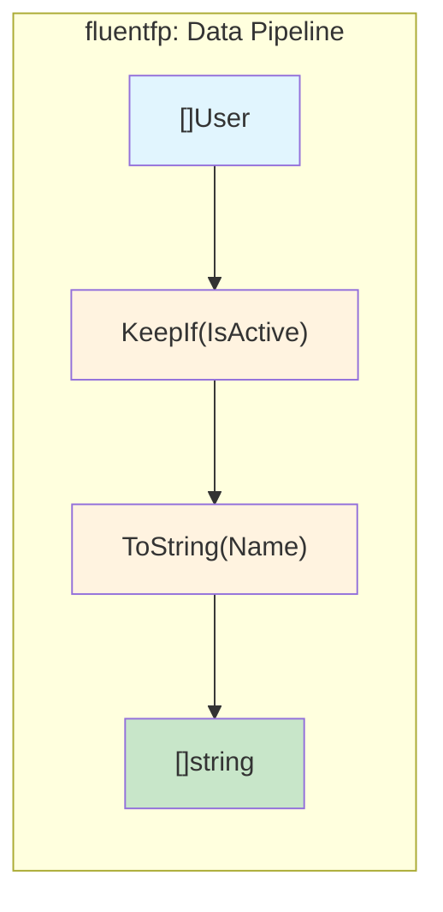
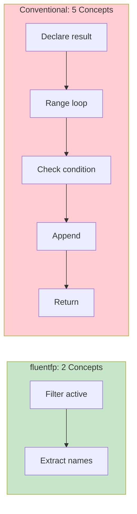

# fluentfp Analysis

fluentfp is a genuine readability improvement for Go. The core insight: **method chaining abstracts iteration mechanics**, letting you read code as a sequence of transformations rather than machine instructions.

## The Core Difference




A loop interleaves 4 concerns—variable declaration, iteration syntax (with discarded `_`), append mechanics, and return. fluentfp collapses these into one expression:

```go
// fluentfp: what you want
names := slice.From(users).
    KeepIf(User.IsActive).
    ToString(User.Name)

// Conventional: how to get it
var names []string
for _, u := range users {
    if u.IsActive() {
        names = append(names, u.Name)
    }
}
```

## Mental Load Comparison



## The Invisible Familiarity Discount

A Go developer looks at `for _, t := range tickets { if ... { count++ } }` and "sees" it instantly. But that's pattern recognition from thousands of repetitions, not inherent simplicity.

**The tell:** Show that loop to a non-programmer, then show them `KeepIf(isActive).Len()`. Which one can they parse?

**The real test:** Come back to your own code after 6 months. The loop requires re-simulation ("what is this accumulating? oh, it's counting matches"). The chain states intent directly.

The invisible familiarity discount: a pattern you've seen 10,000 times *feels* simple, but still requires parsing mechanics. This doesn't mean fluentfp is always clearer—conventional loops win in many cases (see "When Not to Use fluentfp" below). But be aware of the discount when comparing. fluentfp expresses intent without mechanics to parse—the simplicity is inherent, not learned.

**Loop syntax variations add ambiguity.** Before writing a `for` loop, you must answer several questions:

1. **Range or C-style?**
   - Range: iterating over a collection
   - C-style: need custom start, stop, or step

2. **If range, which form?**
   - `for i, x := range` — need both index and value
   - `for _, x := range` — need value only (discard index)
   - `for i := range` — need index only (discard value)
   - `for x := range ch` — consuming a channel

3. **If C-style, what are the bounds?**
   - `for i := 0; i < len(s); i++` — standard forward
   - `for i := len(s) - 1; i >= 0; i--` — reverse
   - `for i := 0; i < len(s); i += 2` — skip elements
   - `for i := start; i < end; i++` — slice of slice

4. **What am I accumulating?**
   - New slice? → `var result []T` + `append`
   - Count? → `count := 0` + `count++`
   - Sum? → `var total T` + `total +=`
   - Single value? → `var found T` + `break`

Each decision is a branch point where bugs can enter. fluentfp methods have one form each—`KeepIf` always filters, `ToFloat64` always extracts—no decisions to make, no ambiguity to resolve.

## Concerns Factored, Not Eliminated

fluentfp doesn't make iteration disappear—it moves it into the library.

**Your call site:**
```go
return slice.From(history).ToFloat64(Record.GetValue)
```

**What the library does:**
- `make([]float64, len(input))` — allocation
- `for i, t := range input` — iteration with index
- `results[i] = fn(t)` — transformation and assignment
- `return results` — return

The same four concerns exist. The difference: the library handles them in one place, not every call site. You handle only what varies—the extraction function.

**The trade-off:**
- **Conventional**: Write mechanics at every call site
- **fluentfp**: Library writes mechanics once; you write only what varies

## Method Expressions: The Cleanest Chains

The preference hierarchy: **method expressions → named functions → inline lambdas**.

```go
// Best: method expressions read as English
slice.From(developers).KeepIf(Developer.IsIdle)
slice.From(history).ToFloat64(Record.GetLeadTime)

// Good: named function documents intent
// completedAfterCutoff returns true if ticket was completed after the cutoff tick.
completedAfterCutoff := func(t Ticket) bool { return t.CompletedTick >= cutoff }
slice.From(tickets).
    KeepIf(completedAfterCutoff).
    Len()
```

When you write `users.KeepIf(User.IsActive).ToString(User.Name)`, there's no function body to parse—it reads like English.

**Critical requirement:** Method expressions require value receivers. `slice.From(users)` creates `Mapper[User]`, so `User.IsActive` must have receiver type `User`, not `*User`. Pointer receivers are common in Go codebases, and fluentfp still works with them as well—you just have to write anonymous functions rather than use the English-like method expression.

## Quantified Benefits

Line counts include what I consider essential comments.

| Pattern                | fluentfp | Conventional |
| ---------------------- | -------- | ------------ |
| Filter + Return        | 1 line   | 7 lines      |
| Filter + Count         | 3 lines  | 7 lines      |
| Field Extraction (Map) | 1 line   | 5 lines      |
| Fold (Reduce)          | 3 lines  | 5 lines      |

## Real Patterns

### Filter + Return
```go
// fluentfp
actives := slice.From(users).KeepIf(User.IsActive)

// Conventional
// Filter to active users
var actives []User
for _, u := range users {
    if u.IsActive() {
        actives = append(actives, u)
    }
}
```

### Filter + Count
```go
// fluentfp
openCount := slice.From(incidents).
    KeepIf(Incident.IsOpen).
    Len()

// Conventional
// Count open incidents
count := 0
for _, inc := range incidents {
    if inc.IsOpen() {
        count++
    }
}
```

### Field Extraction (Map)
```go
// fluentfp with method expression
values := slice.From(history).ToFloat64(Snapshot.GetPercent)

// fluentfp with named function (when no method exists)
// getPercent extracts the Percent field from a Snapshot.
getPercent := func(s Snapshot) float64 { return s.Percent }
values := slice.From(history).ToFloat64(getPercent)

// Conventional
// Extract percent values from history
values := make([]float64, len(history))
for i, s := range history {
    values[i] = s.Percent
}
```

### Fold (Reduce)
```go
// fluentfp with named reducer
// sumDuration adds two durations.
sumDuration := func(a, b time.Duration) time.Duration { return a + b }
total := slice.Fold(durations, time.Duration(0), sumDuration)

// Conventional
// Sum all durations
var total time.Duration
for _, d := range durations {
    total += d
}
```

## Correctness by Construction

Line counts don't capture bugs avoided. These bugs are from production Go code—all compiled, all passed code review.

| Bug Pattern                   | Why Subtle               | fluentfp Eliminates?   |
| ----------------------------- | ------------------------ | ---------------------- |
| Index typo (`i+i` not `i+1`)  | Looks intentional        | ✓ No index           |
| Defer in loop                 | Defers pile up silently  | ✓ No loop body       |
| Error shadowing (`:=` vs `=`) | Normal Go syntax         | ✓ No local variables |
| Input slice mutation          | No hint function mutates | ✓ Returns new slice  |

**Error shadowing (`:=` vs `=`):**
```go
// BUG: err is local to loop, outer err unchanged
func ProcessItems(items []Item) {
    for _, item := range items {
        _, err := process(item)  // := shadows outer err
        if err != nil { log.Print(err) }
    }
    // returns nil even if errors occurred
}
```

**Defer in loop:**
```go
// BUG: all Close() calls wait until function returns
for _, id := range ids {
    conn, _ := client.OpenConnection(id)
    defer conn.Close()  // N defers pile up
}
// N connections held until here
```

These bugs compile, pass review, and look correct. They don't exist in fluentfp code because the mechanics that contain them don't exist—no index to typo, no loop body to defer in, no local variable to shadow.

**Note on linters:** Some of these bugs (like defer in loop) can be caught by static analysis tools. But linters require running, configuring, and acting on warnings. fluentfp is correctness by construction—the bug isn't caught, it's unwritable.

## Why Named Functions Matter

Anonymous lambdas in chains force you to parse:
1. Higher-order syntax (`func(x Type) bool { ... }`)
2. Predicate logic (the condition inside)
3. Chain context (what comes before/after)

A named function like `completedAfterCutoff` lets you skip the first two and read intent directly. Naming also aids your own understanding—articulating what a predicate does crystallizes your thinking.

## Design Decisions

**Interoperability is frictionless.** fluentfp slices auto-convert to native slices and back. Pass them to standard library functions, range over them, index them. Use fluentfp for one transformation in an otherwise imperative function without ceremony.

**Bounded API surface.** Each package solves specific patterns cleanly:
- `slice`: KeepIf, RemoveIf, Convert, ToX, Each, Fold—no FlatMap/GroupBy sprawl
- `option`: Of, Get, Or—no monadic bind chains
- `must`: Get, BeNil, Of—three functions
- `ternary`: If, Then, Else

The restraint is deliberate: solve patterns cleanly without becoming a framework.

**Works with Go's type system.** Generics are used minimally—`Mapper[T]` and `MapperTo[R, T]` are the extent of it. No reflection, no `any` abuse, no code generation. Type safety is preserved throughout.

## When Not to Use fluentfp


1. **Channel consumption** - `for r := range ch` has no FP equivalent
2. **Complex control flow** - break, continue, early return within iteration
3. **Index-dependent logic** - when you need `i` for more than just indexing

These aren't failures of functional style—they're cases where imperative control flow is genuinely clearer.
