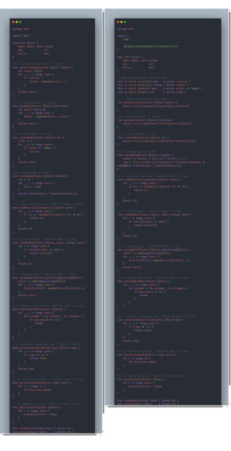
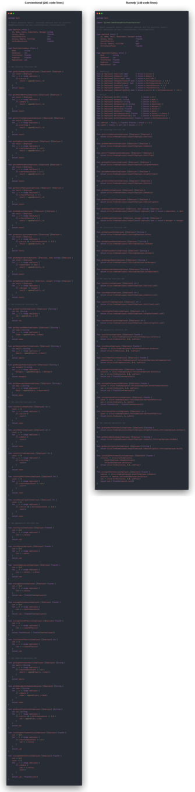
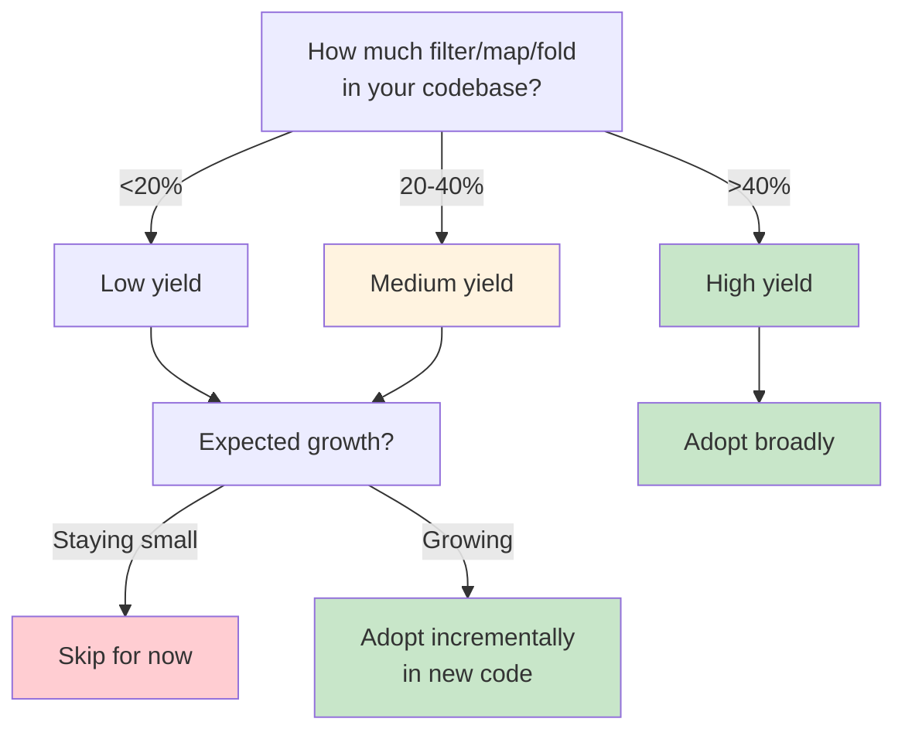

# fluentfp Analysis

> **Summary:** Eliminate control structures, eliminate the bugs they enable. Mixed codebases see 26% complexity reduction; pure pipelines drop 95%. The win isn't lines saved—it's bugs that become unwritable.

Same operation, two styles:

| Conventional (6 lines, 2 indent levels) | FP (1 line) |
|----------------------------------------|-------------|
| <pre>var active []User<br>for _, u := range users {<br>    if u.IsActive() {<br>        active = append(active, u)<br>    }<br>}</pre> | <pre>active := slice.From(users).KeepIf(User.IsActive)</pre> |

The conventional version has more indentation. Why does that matter? (Line counts depend on [[methodology#g-chain-formatting-rules|formatting conventions]]—see methodology.)

## What Creates the Indentation

Control structures require indented bodies. A `for` loop needs a body—that's one level. An `if` inside the loop needs its own body—that's two levels. Nesting compounds: each control structure pushes the code rightward.

```go
// Conventional: control structures create indentation
var names []string                    // level 0
for _, u := range users {             // level 0 → body at level 1
    if u.IsActive() {                 // level 1 → body at level 2
        names = append(names, u.Name) // level 2
    }
}
```

The jagged left edge in the silhouette of the code *is* the control structures. Every indent represents a `for`, `if`, or `switch` that Go's syntax requires you to express.

```go
// fluentfp: no control structures, no indentation
names := slice.From(users).KeepIf(User.IsActive).ToString(User.Name)
```

Even multiline chains have only *formatting* indentation (a style choice), not *structural* indentation (syntax-required block bodies). The former is cosmetic; the latter signals complexity.

## Why Less Indentation Matters

The same constructs that create indentation—`for`, `if`, `switch`—are what complexity metrics count. They're branch points: places where execution can go different ways.

**Less indentation → fewer control structures → fewer branch points → fewer execution paths.**

Fewer execution paths means:
- Less to reason about when reading
- Fewer states to test
- Fewer opportunities for error

This isn't metaphor. The correlation table in [Measuring the Correlation](#measuring-the-correlation) shows indent reduction tracking cyclometric complexity metric reduction almost perfectly: 27%/26% in the mixed case, 80%/95% in the pure pipeline case.

**Practical rule of thumb:** You can estimate complexity at a glance by counting indentation levels—no need to run a tool. More indentation means more control structures means higher complexity.

The principle: **levers you don't have can't be pulled incorrectly**. We'll return to this in [The Principle](#the-principle).

## How FP Eliminates Control Structures

Functional programming converts element-by-element control flow into collection-as-unit transformation. The iteration still happens—inside the library. The condition still exists—but as data (a function value), not as branching syntax.

```go
// Conventional: you write the mechanics
count := 0
for _, u := range users {
    if u.IsActive() {
        count++
    }
}

// fluentfp: library handles mechanics
count := slice.From(users).
    KeepIf(User.IsActive).
    Len()
```

### Why This Reduces Mental Load

The key isn't that FP has fewer concepts—it's that they **compose**.

A conventional loop bundles four concerns together: variable declaration, iteration syntax, condition, and accumulation. You need all four to write *any* loop. Want to count? Four things. Want to filter? Four things. Want to extract a field? Four things. (But see [the familiarity discount](#the-familiarity-discount).)

FP has an entry cost—you learn the chaining pattern and how to pass functions as data. But then each operation (filter, map, fold) is *one* thing. And they compose: learn one, use it everywhere. Learn another, chain it with the first.

| Approach | Cost Model |
|----------|------------|
| Conventional | 4 things bundled, every time |
| FP | Entry cost + 1 operation at a time |

**The formula:** Conventional patterns cost 4×N (four things, N times). FP operations cost entry + N (learn entry once, then one thing at a time).

**Punchline:** Conventional patterns don't compose; FP operations do.

**Applicability:** In a production codebase (608 loops), 33-41% were fluentfp-replaceable. The rest required complex control flow, channels, or Go idioms (table-driven tests).

### The Familiarity Discount

A `for` loop you've seen 10,000 times feels instant to parse—but only because you've fully mentally indexed the cognitive load through repetition. The four concerns don't disappear; you've just trained yourself to see them as one chunk.

This doesn't mean fluentfp is always clearer. Be aware of the discount when comparing: fluentfp's simplicity is inherent (fewer moving parts), while loop familiarity is learned (same parts, practiced recognition).

## Measuring the Correlation

We measured total indentation (sum of leading tabs) against complexity (scc's branch/loop token count). Both metrics trace to the same source: control structures.

| Version | Total Indent | Complexity | Indent Change | Complexity Change |
|---------|--------------|------------|----------|--------------|
| Conventional | 97 | 23 | — | — |
| fluentfp | 71 | 17 | −27% | −26% |
| Best-case Conv. | 306 | 57 | — | — |
| Best-case FP | 60 | 3 | −80% | −95% |

The correlation holds across both cases. In the mixed-code example (36% convertible), indent and complexity drop nearly identically. In the pure-pipeline example (100% convertible), complexity drops *faster*—a chain can have visual indentation with zero branch points.

*Source: [examples/code-shape](examples/code-shape). Measured with [scc](https://github.com/boyter/scc).*

### Typical Case: Mixed Code

Most modules mix FP-convertible patterns with code that should stay as loops. This example intentionally mirrors a typical production ratio—36% convertible, 64% conventional loops.



| Version | Code | Complexity |
|---------|------|------------|
| Conventional | 91 | 23 |
| fluentfp | 80 | 17 |
| **Reduction** | **12%** | **26%** |

The 12% code reduction seems modest. But complexity dropped 26%—the convertible functions lost their branch points while the unchanged loops kept theirs. At scale, both obey the law of truly large numbers: 12% of 500 kloc is 60,000 lines; 26% fewer branch points means 26% fewer opportunities for error (see [[methodology#h-real-world-loop-bugs|Real-World Loop Bugs]]).

### Best Case: Pure Data Pipeline

What about modules that are *entirely* data transformations? Report generators, ETL jobs—pure filter/map/fold. This is the ceiling for fluentfp's impact.

| Version | Code | Complexity |
|---------|------|------------|
| Conventional | 281 | 57 |
| fluentfp | 148 | 3 |
| **Reduction** | **47%** | **95%** |

> **Key result:** When code is pure filter/map/fold, complexity drops from 57 to 3—a 95% reduction in branch points.



*Source: [examples/code-shape/best-case-*](examples/code-shape)*

47% code reduction when all operations fit the functional pattern. Complexity drops 57 to 3—every `for` and `if` is gone, nothing for scc to count. Predicate methods like `IsActive` often already exist on your types; you're reusing code, not adding overhead. Real codebases fall between 12% (mixed) and 47% (pure pipelines), depending on the module.

**A note on scale:** 12% may not feel compelling on a small project. But codebases grow. At 500 kloc, 12% is 60,000 lines. At that scale, the law of truly large numbers starts to matter—for build times, code review burden, and cognitive load.

## The Principle

The complexity numbers tell the deeper story. 95% fewer branch points means 95% fewer places where execution can diverge—fewer paths to test, fewer opportunities for the bugs that live in control flow.

The principle is *correctness by construction*: design systems so errors can't occur, rather than catching them after the fact. FP embodies this—the mechanics of imperative iteration (indexes to mistype, accumulators to forget, break/continue to misplace) simply don't exist in FP code. You can't typo `i+i` instead of `i+1` when there's no `i`. You can't forget to initialize an accumulator when there's no accumulator. You can't put a `defer` in a loop body when there's no loop body.

In manufacturing, the physical manifestation of this principle is *poka-yoke* (ポカヨケ)—the Toyota Production System's term for mistake-proofing. A part that only fits one way. A switch that won't activate unless the guard is down. Don't train workers to avoid mistakes; design the process so mistakes become impossible.

The narrower silhouette isn't just about reading ease or line counts. It's correctness by construction.

## Trade-offs

Not all code benefits equally from fluentfp. The return depends on what your code *does*.

### High-Yield Code Patterns

**Data pipeline modules** (up to 47% reduction—see [best-case analysis](#best-case-pure-data-pipeline)):
- Report generators, ETL jobs, metrics aggregators
- Characteristics: primarily filter/map/fold operations, batch data, pure transformations

**Controller/orchestration code** (12-40% reduction depending on filter/map density):
- API handlers that collect and transform data before response
- Kubernetes controllers filtering resources by state
- CLI tools processing command output
- Characteristics: query → filter → transform → return patterns

From Kubernetes' [deployment_util.go](https://github.com/kubernetes/kubernetes/blob/master/pkg/controller/deployment/util/deployment_util.go):

**Field extraction.** Extract container names from a pod—a common pattern when building responses or logs.

```go
// Kubernetes original
var names []string
for _, c := range pod.Spec.Containers {
    names = append(names, c.Name)
}
return names
```

```go
// fluentfp equivalent
// getName returns the container's name.
getName := func(c Container) string { return c.Name }
return slice.From(pod.Spec.Containers).ToString(getName)
```

**Filtering by exclusion.** Remove conditions matching a specific type. The loop uses `continue` to skip matches—an inverted pattern where you express what to *exclude* rather than what to *keep*.

```go
// Kubernetes original
var newConditions []apps.DeploymentCondition
for _, c := range conditions {
    if c.Type == condType {
        continue
    }
    newConditions = append(newConditions, c)
}
return newConditions
```

```go
// fluentfp equivalent
// hasCondType returns true if the condition matches the target type.
hasCondType := func(c apps.DeploymentCondition) bool { return c.Type == condType }
return slice.From(conditions).RemoveIf(hasCondType)
```

**Configuration/validation code** (similar patterns, smaller scale):
- Checking lists of config values against rules
- Validating collections of inputs
- Characteristics: many predicate-based filters

**Config validation.** Find configs with debug mode enabled (shouldn't ship to prod).

```go
// Original
var debugConfigs []Config
for _, c := range configs {
    if c.Debug {
        debugConfigs = append(debugConfigs, c)
    }
}
```

```go
// fluentfp equivalent
debugConfigs := slice.From(configs).KeepIf(Config.IsDebug)
```

5 lines → 1 line. Uses method expression (assumes `func (c Config) IsDebug() bool` exists on type).

### Lower-Yield Code Patterns

**I/O-bound handlers** (minimal reduction):
- HTTP handlers with mostly database/API calls
- Characteristics: side effects dominate, few pure transformations

**Graph/tree traversal** (minimal benefit):
- Terraform's provider resolution, AST walkers
- Characteristics: recursive patterns, stateful traversal, break/continue control flow

**Streaming pipelines** (not applicable):
- Channel-based data flow, unbounded input
- fluentfp operates on batch (in-memory) slices, not streams

### Choosing Whether to Adopt



The decision isn't binary. fluentfp is valuable even for lower-yield code—the clarity and bug prevention still apply. But for small projects that won't grow, the adoption cost may not justify the modest line savings. As codebases scale, those modest percentages become substantial absolute numbers.

### When to Use Loops


1. **Channel consumption** - `for r := range ch` has no FP equivalent
2. **Complex control flow** - break, continue, early return within iteration
3. **Index-dependent logic** - when you need `i` for more than just indexing

These are intentional boundaries. Use loops when necessary—just recognize that loops are neither the clearest nor the safest choice for the patterns FP handles well.

## Performance Characteristics

fluentfp uses eager evaluation—each operation materializes its result immediately.

**Allocation model:**
```go
// Chain: 2 allocations (one per intermediate result)
names := slice.From(users).       // No allocation (type conversion)
    KeepIf(User.IsActive).        // Allocation 1: filtered slice
    ToString(User.GetName)        // Allocation 2: string slice

// Manual loop: 1 allocation
var names []string
for _, u := range users {
    if u.IsActive() { names = append(names, u.Name) }
}
```

Chains allocate more than fused loops. The intermediate slices become garbage after the chain completes. For most code, GC handles this invisibly.

**Single-pass alternatives:**
- `Fold` accumulates without intermediate slices
- `Unzip2/3/4` extracts multiple fields in one iteration

**When to stay imperative:**
- **Hot loops** identified by profiling—not speculation
- **Pre-allocated buffers** you're reusing across calls
- **Fused operations** where a single loop does filter + transform + accumulate

**Rule of thumb:** Use fluentfp by default. The allocation overhead matters in hot paths; profile to find them. Everywhere else, clarity wins.

## Patterns in Practice

### Filter + Return
```go
// fluentfp
actives := slice.From(users).KeepIf(User.IsActive)

// Conventional
// Filter to active users
var actives []User
for _, u := range users {
    if u.IsActive() {
        actives = append(actives, u)
    }
}
```

### Filter + Count
```go
// fluentfp
openCount := slice.From(incidents).
    KeepIf(Incident.IsOpen).
    Len()

// Conventional
// Count open incidents
count := 0
for _, inc := range incidents {
    if inc.IsOpen() {
        count++
    }
}
```

### Field Extraction (Map)
```go
// fluentfp with method expression
values := slice.From(history).ToFloat64(Snapshot.GetPercent)

// fluentfp with named function (when no method exists)
// getPercent extracts the Percent field from a Snapshot.
getPercent := func(s Snapshot) float64 { return s.Percent }
values := slice.From(history).ToFloat64(getPercent)

// Conventional
// Extract percent values from history
values := make([]float64, len(history))
for i, s := range history {
    values[i] = s.Percent
}
```

### Fold (Reduce)
```go
// fluentfp with named reducer
// sumDuration adds two durations.
sumDuration := func(a, b time.Duration) time.Duration { return a + b }
total := slice.Fold(durations, time.Duration(0), sumDuration)

// Conventional
// Sum all durations
var total time.Duration
for _, d := range durations {
    total += d
}
```

## Error Prevention

Line counts don't capture bugs avoided. These bugs are from production Go code—all compiled, all passed code review.

| Bug Pattern                        | Why Subtle               | fluentfp Eliminates? |
| ---------------------------------- | ------------------------ | -------------------- |
| Index usage typo (`i+i` not `i+1`) | Looks intentional        | ✓ No index           |
| Defer in loop                      | Defers pile up silently  | ✓ No loop body       |
| Error shadowing (`:=` vs `=`)      | Normal Go syntax         | ✓ No local variables |
| Input slice mutation               | No hint function mutates | ✓ Returns new slice  |

**Error shadowing (`:=` vs `=`):**
```go
// BUG: err is local to loop, outer err unchanged
func ProcessItems(items []Item) {
    for _, item := range items {
        _, err := process(item)  // := shadows outer err
        if err != nil { log.Print(err) }
    }
    // returns nil even if errors occurred
}
```

**Defer in loop:**
```go
// BUG: all Close() calls wait until function returns
for _, id := range ids {
    conn, _ := client.OpenConnection(id)
    defer conn.Close()  // N defers pile up
}
// N connections held until here
```

These bugs compile, pass review, and look correct. They don't exist in fluentfp code because the mechanics that contain them don't exist—no index to typo, no loop body to defer in, no local variable to shadow.

**Note on linters:** Some of these bugs (like defer in loop) can be caught by static analysis tools. But linters require running, configuring, and acting on warnings. fluentfp is correctness by construction—the bug isn't caught, it's unwritable.

## Why Named Functions Matter

Anonymous lambdas in chains force you to parse:
1. Higher-order syntax (`func(x Type) bool { ... }`)
2. Predicate logic (the condition inside)
3. Chain context (what comes before/after)

A named function like `completedAfterCutoff` lets you skip the first two and read intent directly. Naming also aids your own understanding—articulating what a predicate does crystallizes your thinking.

## Design Decisions

**Interoperability is frictionless.** fluentfp slices auto-convert to native slices and back. Pass them to standard library functions, range over them, index them. Use fluentfp for one transformation in an otherwise imperative function without ceremony.

**Bounded API surface.** Each package solves specific patterns cleanly:
- `slice`: KeepIf, RemoveIf, Convert, ToX, Each, Fold—no FlatMap/GroupBy sprawl
- `option`: Of, Get, Or—no monadic bind chains
- `must`: Get, BeNil, Of—three functions
- `ternary`: If, Then, Else

The restraint is deliberate: solve patterns cleanly without becoming a framework.

**Works with Go's type system.** Generics are used minimally—`Mapper[T]` and `MapperTo[R, T]` are the extent of it. No reflection, no `any` abuse, no code generation. Type safety is preserved throughout.

## Nil Safety

Go's `nil` pointers are a source of runtime panics. fluentfp addresses this through two complementary strategies:

1. **Value semantics**: Prefer value types and value receivers—no pointer means no nil
2. **Option types**: When optionality is genuine, use `option.Basic[T]` to make absence explicit

The `option` package provides correctness by construction: there's no nil to check because there's no nil. The boolean `ok` flag replaces the entire category of nil-related bugs.

For the full discussion—including Tony Hoare's "billion-dollar mistake" confession, Go's nil problem, and real-world patterns—see [[nil-safety|Nil Safety in Go]].

## Methodology

For empirical methodology details—how claims were derived, replication guides, and real-world loop bug examples—see [[methodology]].
