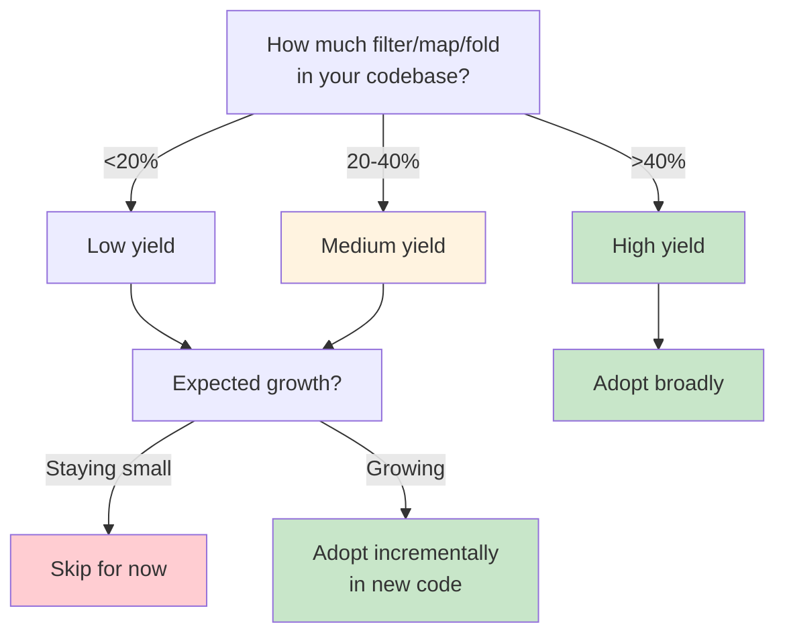

# fluentfp Analysis

Same operation, two styles:

**Conventional (6 lines, 2 indent levels):**
```go
var active []User
for _, u := range users {
    if u.IsActive() {
        active = append(active, u)
    }
}
```

**FP (1 line):**
```go
active := slice.From(users).KeepIf(User.IsActive)
```

The conventional version has more indentation. Why does that matter? (Line counts depend on [formatting conventions](#g-chain-formatting-rules)—see methodology.)

## What Creates the Indentation

Control structures require indented bodies. A `for` loop needs a body—that's one level. An `if` inside the loop needs its own body—that's two levels. Nesting compounds: each control structure pushes the code rightward.

```go
// Conventional: control structures create indentation
var names []string                    // level 0
for _, u := range users {             // level 0 → body at level 1
    if u.IsActive() {                 // level 1 → body at level 2
        names = append(names, u.Name) // level 2
    }
}
```

The jagged left edge in the conventional silhouette *is* the control structures. Every indent represents a `for`, `if`, or `switch` that Go's syntax requires you to express.

```go
// fluentfp: no control structures, no indentation
names := slice.From(users).KeepIf(User.IsActive).ToString(User.Name)
```

Even multiline chains have only *formatting* indentation (a style choice), not *structural* indentation (syntax-required block bodies). The former is cosmetic; the latter signals complexity.

## Why Less Indentation Matters

The same constructs that create indentation—`for`, `if`, `switch`—are what complexity metrics count. They're branch points: places where execution can go different ways.

**Less indentation → fewer control structures → fewer branch points → fewer execution paths.**

Fewer execution paths means:
- Less to reason about when reading
- Fewer states to test
- Fewer opportunities for error

This isn't metaphor. The correlation table in [Measuring the Correlation](#measuring-the-correlation) shows indent reduction tracking complexity reduction almost perfectly: 27%/26% in the mixed case, 80%/95% in the pure pipeline case.

**Practical rule of thumb:** You can estimate complexity at a glance by counting indentation levels—no need to run a tool. More indentation means more control structures means higher complexity.

The principle: **levers you don't have can't be pulled incorrectly**. We'll return to this in [The Principle](#the-principle).

## How FP Eliminates Control Structures

Functional programming converts element-by-element control flow into collection-as-unit transformation. The iteration still happens—inside the library. The condition still exists—but as data (a function value), not as branching syntax.

```go
// Conventional: you write the mechanics
count := 0
for _, u := range users {
    if u.IsActive() {
        count++
    }
}

// fluentfp: library handles mechanics
count := slice.From(users).
    KeepIf(User.IsActive).
    Len()
```

### Why This Reduces Mental Load

The key isn't that FP has fewer concepts—it's that they **compose**.

A conventional loop bundles four concerns together: variable declaration, iteration syntax, condition, and accumulation. You need all four to write *any* loop. Want to count? Four things. Want to filter? Four things. Want to extract a field? Four things. (But see [the familiarity discount](#the-familiarity-discount).)

FP has an entry cost—you learn the chaining pattern and how to pass functions as data. But then each operation (filter, map, fold) is *one* thing. And they compose: learn one, use it everywhere. Learn another, chain it with the first.

| Approach | Cost Model |
|----------|------------|
| Conventional | 4 things bundled, every time |
| FP | Entry cost + 1 operation at a time |

**The formula:** Conventional patterns cost 4×N (four things, N times). FP operations cost entry + N (learn entry once, then one thing at a time).

**Punchline:** Conventional patterns don't compose; FP operations do.

**Applicability:** In a production codebase (608 loops), 33-41% were fluentfp-replaceable. The rest required complex control flow, channels, or Go idioms (table-driven tests).

### The Familiarity Discount

A `for` loop you've seen 10,000 times feels instant to parse—but only because you've amortized the cognitive load through repetition. The four concerns don't disappear; you've just trained yourself to see them as one chunk.

This doesn't mean fluentfp is always clearer. Be aware of the discount when comparing: fluentfp's simplicity is inherent (fewer moving parts), while loop familiarity is learned (same parts, practiced recognition).

## Measuring the Correlation

We measured total indentation (sum of leading tabs) against complexity (scc's branch/loop token count). Both metrics trace to the same source: control structures.

| Version | Total Indent | Complexity | Indent Change | Complexity Change |
|---------|--------------|------------|----------|--------------|
| Conventional | 97 | 23 | — | — |
| fluentfp | 71 | 17 | −27% | −26% |
| Best-case Conv. | 306 | 57 | — | — |
| Best-case FP | 60 | 3 | −80% | −95% |

The correlation holds across both cases. In the mixed-code example (36% convertible), indent and complexity drop nearly identically. In the pure-pipeline example (100% convertible), complexity drops *faster*—a chain can have visual indentation with zero branch points.

*Source: [examples/code-shape](examples/code-shape). Measured with [scc](https://github.com/boyter/scc).*

### Typical Case: Mixed Code

Most modules mix FP-convertible patterns with code that should stay as loops. This example intentionally mirrors a typical production ratio—36% convertible, 64% conventional loops.


| Version | Code | Complexity |
|---------|------|------------|
| Conventional | 91 | 23 |
| fluentfp | 80 | 17 |
| **Reduction** | **12%** | **26%** |

The 12% code reduction seems modest. But complexity dropped 26%—the convertible functions lost their branch points while the unchanged loops kept theirs. At scale, both compound: 12% of 500 kloc is 60,000 lines; 26% fewer branch points means 26% fewer opportunities for error (see [Appendix H](#h-real-world-loop-bugs)).

### Best Case: Pure Data Pipeline

What about modules that are *entirely* data transformations? Report generators, ETL jobs—pure filter/map/fold. This is the ceiling for fluentfp's impact.

| Version | Code | Complexity |
|---------|------|------------|
| Conventional | 281 | 57 |
| fluentfp | 148 | 3 |
| **Reduction** | **47%** | **95%** |


*Source: [examples/code-shape/best-case-*](examples/code-shape)*

47% code reduction when all operations fit the functional pattern. Complexity drops 57 to 3—every `for` and `if` is gone, nothing for scc to count. Predicate methods like `IsActive` often already exist on your types; you're reusing code, not adding overhead. Real codebases fall between 12% (mixed) and 47% (pure pipelines), depending on the module.

**A note on scale:** 12% may not feel compelling on a small project. But codebases grow. At 500 kloc, 12% is 60,000 lines. At that scale, small percentages start to matter—for build times, code review burden, and cognitive load.

## The Principle

The complexity numbers tell the deeper story. 95% fewer branch points doesn't just mean less to test—it means 95% fewer levers available to pull incorrectly.

The principle is *correctness by construction*: design systems so errors can't occur, rather than catching them after the fact. FP embodies this—the mechanics of imperative iteration (indexes to mistype, accumulators to forget, break/continue to misplace) simply don't exist in FP code. You can't typo `i+i` instead of `i+1` when there's no `i`. You can't forget to initialize an accumulator when there's no accumulator. You can't put a `defer` in a loop body when there's no loop body.

In manufacturing, the physical manifestation of this principle is *poka-yoke* (ポカヨケ)—the Toyota Production System's term for mistake-proofing. A part that only fits one way. A switch that won't activate unless the guard is down. Don't train workers to avoid mistakes; design the process so mistakes become impossible.

The narrower silhouette isn't just about reading ease or line counts. It's correctness by construction.

## Trade-offs

Not all code benefits equally from fluentfp. The return depends on what your code *does*.

### High-Yield Code Patterns

**Data pipeline modules** (up to 47% reduction—see [best-case analysis](#best-case-pure-data-pipeline)):
- Report generators, ETL jobs, metrics aggregators
- Characteristics: primarily filter/map/fold operations, batch data, pure transformations

**Controller/orchestration code** (12-40% reduction depending on filter/map density):
- API handlers that collect and transform data before response
- Kubernetes controllers filtering resources by state
- CLI tools processing command output
- Characteristics: query → filter → transform → return patterns

From Kubernetes' [deployment_util.go](https://github.com/kubernetes/kubernetes/blob/master/pkg/controller/deployment/util/deployment_util.go):

**Field extraction.** Extract container names from a pod—a common pattern when building responses or logs.

```go
// Kubernetes original
var names []string
for _, c := range pod.Spec.Containers {
    names = append(names, c.Name)
}
return names
```

```go
// fluentfp equivalent
// getName returns the container's name.
getName := func(c Container) string { return c.Name }
return slice.From(pod.Spec.Containers).ToString(getName)
```

**Filtering by exclusion.** Remove conditions matching a specific type. The loop uses `continue` to skip matches—an inverted pattern where you express what to *exclude* rather than what to *keep*.

```go
// Kubernetes original
var newConditions []apps.DeploymentCondition
for _, c := range conditions {
    if c.Type == condType {
        continue
    }
    newConditions = append(newConditions, c)
}
return newConditions
```

```go
// fluentfp equivalent
// hasCondType returns true if the condition matches the target type.
hasCondType := func(c apps.DeploymentCondition) bool { return c.Type == condType }
return slice.From(conditions).RemoveIf(hasCondType)
```

**Configuration/validation code** (similar patterns, smaller scale):
- Checking lists of config values against rules
- Validating collections of inputs
- Characteristics: many predicate-based filters

**Config validation.** Find configs with debug mode enabled (shouldn't ship to prod).

```go
// Original
var debugConfigs []Config
for _, c := range configs {
    if c.Debug {
        debugConfigs = append(debugConfigs, c)
    }
}
```

```go
// fluentfp equivalent
debugConfigs := slice.From(configs).KeepIf(Config.IsDebug)
```

5 lines → 1 line. Uses method expression (assumes `func (c Config) IsDebug() bool` exists on type).

### Lower-Yield Code Patterns

**I/O-bound handlers** (minimal reduction):
- HTTP handlers with mostly database/API calls
- Characteristics: side effects dominate, few pure transformations

**Graph/tree traversal** (minimal benefit):
- Terraform's provider resolution, AST walkers
- Characteristics: recursive patterns, stateful traversal, break/continue control flow

**Streaming pipelines** (not applicable):
- Channel-based data flow, unbounded input
- fluentfp operates on batch (in-memory) slices, not streams

### Choosing Whether to Adopt



The decision isn't binary. fluentfp is valuable even for lower-yield code—the clarity and bug prevention still apply. But for small projects that won't grow, the adoption cost may not justify the modest line savings. As codebases scale, those modest percentages become substantial absolute numbers.

### When to Use Loops


1. **Channel consumption** - `for r := range ch` has no FP equivalent
2. **Complex control flow** - break, continue, early return within iteration
3. **Index-dependent logic** - when you need `i` for more than just indexing

These are intentional boundaries. Use loops when necessary—just recognize that loops are neither the clearest nor the safest choice for the patterns FP handles well.

## Patterns in Practice

### Filter + Return
```go
// fluentfp
actives := slice.From(users).KeepIf(User.IsActive)

// Conventional
// Filter to active users
var actives []User
for _, u := range users {
    if u.IsActive() {
        actives = append(actives, u)
    }
}
```

### Filter + Count
```go
// fluentfp
openCount := slice.From(incidents).
    KeepIf(Incident.IsOpen).
    Len()

// Conventional
// Count open incidents
count := 0
for _, inc := range incidents {
    if inc.IsOpen() {
        count++
    }
}
```

### Field Extraction (Map)
```go
// fluentfp with method expression
values := slice.From(history).ToFloat64(Snapshot.GetPercent)

// fluentfp with named function (when no method exists)
// getPercent extracts the Percent field from a Snapshot.
getPercent := func(s Snapshot) float64 { return s.Percent }
values := slice.From(history).ToFloat64(getPercent)

// Conventional
// Extract percent values from history
values := make([]float64, len(history))
for i, s := range history {
    values[i] = s.Percent
}
```

### Fold (Reduce)
```go
// fluentfp with named reducer
// sumDuration adds two durations.
sumDuration := func(a, b time.Duration) time.Duration { return a + b }
total := slice.Fold(durations, time.Duration(0), sumDuration)

// Conventional
// Sum all durations
var total time.Duration
for _, d := range durations {
    total += d
}
```

## Error Prevention

Line counts don't capture bugs avoided. These bugs are from production Go code—all compiled, all passed code review.

| Bug Pattern                        | Why Subtle               | fluentfp Eliminates? |
| ---------------------------------- | ------------------------ | -------------------- |
| Index usage typo (`i+i` not `i+1`) | Looks intentional        | ✓ No index           |
| Defer in loop                      | Defers pile up silently  | ✓ No loop body       |
| Error shadowing (`:=` vs `=`)      | Normal Go syntax         | ✓ No local variables |
| Input slice mutation               | No hint function mutates | ✓ Returns new slice  |

**Error shadowing (`:=` vs `=`):**
```go
// BUG: err is local to loop, outer err unchanged
func ProcessItems(items []Item) {
    for _, item := range items {
        _, err := process(item)  // := shadows outer err
        if err != nil { log.Print(err) }
    }
    // returns nil even if errors occurred
}
```

**Defer in loop:**
```go
// BUG: all Close() calls wait until function returns
for _, id := range ids {
    conn, _ := client.OpenConnection(id)
    defer conn.Close()  // N defers pile up
}
// N connections held until here
```

These bugs compile, pass review, and look correct. They don't exist in fluentfp code because the mechanics that contain them don't exist—no index to typo, no loop body to defer in, no local variable to shadow.

**Note on linters:** Some of these bugs (like defer in loop) can be caught by static analysis tools. But linters require running, configuring, and acting on warnings. fluentfp is correctness by construction—the bug isn't caught, it's unwritable.

## Why Named Functions Matter

Anonymous lambdas in chains force you to parse:
1. Higher-order syntax (`func(x Type) bool { ... }`)
2. Predicate logic (the condition inside)
3. Chain context (what comes before/after)

A named function like `completedAfterCutoff` lets you skip the first two and read intent directly. Naming also aids your own understanding—articulating what a predicate does crystallizes your thinking.

## Design Decisions

**Interoperability is frictionless.** fluentfp slices auto-convert to native slices and back. Pass them to standard library functions, range over them, index them. Use fluentfp for one transformation in an otherwise imperative function without ceremony.

**Bounded API surface.** Each package solves specific patterns cleanly:
- `slice`: KeepIf, RemoveIf, Convert, ToX, Each, Fold—no FlatMap/GroupBy sprawl
- `option`: Of, Get, Or—no monadic bind chains
- `must`: Get, BeNil, Of—three functions
- `ternary`: If, Then, Else

The restraint is deliberate: solve patterns cleanly without becoming a framework.

**Works with Go's type system.** Generics are used minimally—`Mapper[T]` and `MapperTo[R, T]` are the extent of it. No reflection, no `any` abuse, no code generation. Type safety is preserved throughout.

## Nil Safety

Go's `nil` pointers are a source of runtime panics. fluentfp addresses this through two complementary strategies:

1. **Value semantics**: Prefer value types and value receivers—no pointer means no nil
2. **Option types**: When optionality is genuine, use `option.Basic[T]` to make absence explicit

The `option` package provides correctness by construction: there's no nil to check because there's no nil. The boolean `ok` flag replaces the entire category of nil-related bugs.

For the full discussion—including Tony Hoare's "billion-dollar mistake" confession, Go's nil problem, and real-world patterns—see [Nil Safety in Go](nil-safety.md).

## Appendix: Methodology

This appendix documents how empirical claims were derived, enabling readers to verify or replicate the analysis.

**Contents:**
- [A. Loop Sampling Methodology](#a-loop-sampling-methodology)
- [B. Line Classification Rules](#b-line-classification-rules)
- [C. Density Calculation](#c-density-calculation)
- [D. Replication Guide](#d-replication-guide)
- [E. Limitations](#e-limitations)
- [F. Code Metrics Tool (scc)](#f-code-metrics-tool-scc)
- [G. Chain Formatting Rules](#g-chain-formatting-rules)

### A. Loop Sampling Methodology

How 11 representative loops were selected from a production codebase (608 total):

**What counts as "a loop":**
- Each `for` statement = 1 loop (nested loops count separately)
- `for range`, `for i := 0; ...`, and `for { ... }` all count
- Excluded: test files (table-driven tests skew toward simple patterns)

**Selection approach:**
- Systematic sample: every ~55th loop (608 ÷ 11 ≈ 55)
- Starting point chosen randomly
- No cherry-picking or exclusions after selection

**Source:** Analysis performed on an internal production Go project (~15k LOC excluding tests).

### B. Line Classification Rules

Explicit rules for semantic vs syntactic classification:

**Semantic (intent-carrying):**
- Condition expressions: `if x.IsActive()`, `switch`, `case`
- Accumulation statements: `count++`, `result = append(...)`, `total += x`
- Function calls that do work: `process(item)`, `db.Save(record)`
- Return statements with values: `return result`

**Syntactic (mechanics-only):**
- Variable declarations: `var x T`, `x := 0`, `x := make(...)`
- Loop headers: `for _, x := range xs {`, `for i := 0; i < n; i++ {`
- Closing braces: `}` (standalone line)
- Blank lines within loop body
- Comments (don't count toward either)

**Edge cases (judgment calls—reasonable people may differ):**
- `if x.IsActive() {` — semantic (condition is the point; brace is incidental)
- `x := slice.From(xs).` — syntactic (setup/scaffolding)
- `return nil` — we classify as syntactic (no semantic payload), but could argue either way
- `return result` — semantic (delivers computed value)
- `err != nil` checks — syntactic (error handling boilerplate), though essential

**Guiding principle:** If the line would disappear in a pseudocode version, it's syntactic. If it carries domain meaning, it's semantic.

### C. Density Calculation

**Formula:**
```
Semantic Density = Semantic Lines / Total Lines × 100%
```

**Worked example (filter + count):**

Loop version:
```
Total lines: 6
Semantic: 2 (condition, accumulation)
Syntactic: 4 (setup, header, 2 braces)
Density: 2/6 = 33%
```

fluentfp version:
```
Total lines: 3
Semantic: 2 (KeepIf, Len)
Syntactic: 1 (setup line)
Density: 2/3 = 67%
```

### D. Replication Guide

How readers can verify on their own codebase:

1. **Count loops** (excluding tests):
   ```bash
   grep -rn "^\s*for\s" --include="*.go" --exclude="*_test.go" . | wc -l
   ```
   This catches all forms: `for range`, `for i := ...`, `for condition {`, and `for {`.

2. **Sample systematically**: For N loops, take every (N ÷ 10)th loop. Random start point.

3. **For each sampled loop**:
   - Count total lines (from `for` to closing `}`)
   - Count *visual* lines as displayed, not logical statements
   - Multi-line statements: each line counts separately
   - Mark each line semantic or syntactic per Section B rules
   - Calculate: semantic ÷ total × 100

**Multi-line example:**
```go
count := slice.From(users).     // line 1: syntactic (setup)
    KeepIf(User.IsActive).      // line 2: SEMANTIC (filter)
    Len()                       // line 3: SEMANTIC (count)
```
This is 3 visual lines: 1 syntactic + 2 semantic = 67% density.

4. **Aggregate**: Average across all sampled loops

**Expected results for typical Go codebases:**
- Simple transforms: 30-40% semantic density
- Complex control flow: 40-60% semantic density
- Overall average: 35-45% semantic density

Results outside these ranges aren't wrong—they may indicate different coding styles or domain characteristics.

### E. Limitations

**What this metric measures:**
- Vertical space efficiency (lines consumed per unit of intent)
- Proportion of "meaningful" vs "mechanical" code

**What this metric does NOT measure:**
- Readability (dense code isn't always clearer)
- Correctness (fewer lines doesn't mean fewer bugs—though see [Error Prevention](#error-prevention) for how fluentfp eliminates certain bug classes)
- Performance (no runtime implications)
- Maintainability (though reduced boilerplate can help)

**Caveats:**
- Classification involves judgment calls; different analysts may vary by ±5%
- Sample size (11 loops) provides directional insight, not statistical significance
- Results are specific to Go; other languages may differ

This is one lens among many. Use alongside other quality metrics, not as a sole criterion.

### F. Code Metrics Tool (scc)

The [Measuring the Correlation](#measuring-the-correlation) section uses [scc](https://github.com/boyter/scc) (Sloc, Cloc and Code) for line counting and complexity measurement.

**Why scc:**
- Separates code lines from blanks and comments
- Provides complexity estimates at near-zero CPU cost
- Fast enough for large codebases

**Code vs Lines:**
scc distinguishes:
- **Lines**: Total lines including blanks and comments
- **Code**: Executable statements only
- **Blanks**: Empty lines
- **Comments**: Documentation lines

We report **Code** lines for accuracy. Total lines overcount by including whitespace and documentation.

**Complexity metric:**
scc's complexity is an approximation of [cyclomatic complexity](https://en.wikipedia.org/wiki/Cyclomatic_complexity). It counts branch and loop tokens in the code:

- `for`, `if`, `switch`, `while`, `else`
- `||`, `&&`, `!=`, `==`

Each occurrence increments the file's complexity counter. This is cheaper than building an AST but provides a reasonable approximation for comparing files in the same language.

**Why complexity matters:**
Higher complexity = more execution paths = more levers available to pull incorrectly. This is why the 95% complexity reduction matters—it's correctness by construction. See [The Principle](#the-principle) for why eliminating control structures eliminates the bugs they enable.

**Usage:**
```bash
# Compare two files
scc file1.go file2.go

# Find most complex files in a project
scc --by-file -s complexity .
```

**Limitation:** Complexity is comparable only within the same language. Don't compare Go complexity to Python complexity directly.

### G. Chain Formatting Rules

How fluentfp chains are formatted affects line counts. These rules ensure consistent measurement.

**Single operation = single line (ToX methods chain onto previous):**
```go
active := slice.From(users).KeepIf(User.IsActive)
names := slice.From(users).KeepIf(User.IsActive).ToString(User.GetName)
```

**Two+ operations = multiline, each operation on its own line:**
```go
count := slice.From(users).
    KeepIf(User.IsActive).
    Len()
```

**What counts toward multiline:**
- `KeepIf`, `RemoveIf`, `Convert`, `Len`, `Each` — these count
- `slice.From()`, `slice.MapTo[R]()` — setup, doesn't count
- `ToString`, `ToInt`, `ToFloat64` — data extraction, chains onto previous line

**Why this matters:**
By convention, data transformation operations don't add lines—they chain onto existing structure. A single filter is one line (vs 5-7 for a loop). Adding a second operation (filter-then-count) adds one line, not another 5-7. This is the composability advantage: conventional patterns cost 4×N; FP operations cost entry + N.

### H. Real-World Loop Bugs

Loop mechanics create opportunities for error regardless of developer experience. These categories were found in production code:

#### Index Arithmetic
```go
// Bug: i+i instead of i+1 (typo doubles the index)
p.Attributes = append(p.Attributes[:i], p.Attributes[i+i:]...)
```
FluentFP: No manual index math—`RemoveIf` handles element removal.

#### Accumulator Assignment
```java
// Bug: passed 0 instead of accumulator, never incremented
page = getAllEntities(0, pageSize, cond);  // should be: start
// missing: start += page.getItems().size();
```
FluentFP: `Fold` manages the accumulator automatically.

#### Iterator Bounds
```java
// Bug: assumes iterator has 3+ elements without checking
Iterator<String> parts = splitter.split(input).iterator();
String first = parts.next();   // assumes element exists
String second = parts.next();  // assumes element exists
String third = parts.next();   // assumes element exists
```
FluentFP: No manual iteration—element access is bounds-checked.

#### Off-by-One
```c
// Bug: <= iterates one past array end (0-indexed)
for (i = 0; i <= num_channels; i++) {
    channels[i] = init_channel();  // accesses channels[num_channels] - OOB!
}
```
FluentFP: No manual bounds—iteration is over the collection itself.

#### Loop Termination
```java
// Bug: no progress detection causes infinite loop
while (inflater.getRemaining() > 0) {
    inflater.inflate(buffer);  // what if inflate returns 0?
}
```
FluentFP: No while loops—operations are bounded by collection size.

#### Defer in Loop (Go)
```go
// Bug: defer accumulates N times, all execute at function end
for _, item := range items {
    ctx, cancel := context.WithTimeout(parentCtx, timeout)
    defer cancel()  // leaks until function returns
}
```
FluentFP: No loop body reduces (but doesn't eliminate) misplacement risk.

**What FluentFP eliminates:**
- No accumulators to forget (`Fold` handles it)
- No manual indexing (`KeepIf`/`RemoveIf`)
- No index arithmetic (predicates operate on values)
- No manual iteration (no `.next()` calls)
- No off-by-one in bounds (iterate collection, not indices)

**What FluentFP reduces but doesn't eliminate:**
- Defer misplacement (no loop body, but still possible elsewhere)

**What FluentFP does NOT prevent:**
- Predicate logic errors—the user writes that logic either way

**Why this matters:**
These aren't junior developer mistakes. Off-by-one bugs made it into the Linux kernel—likely some of the most reviewed patches anywhere—and they inevitably recur. The same error pattern appears across kernel releases years apart. If the construct allows an error, it will eventually happen; loop mechanics errors are inherent to the construct itself.
