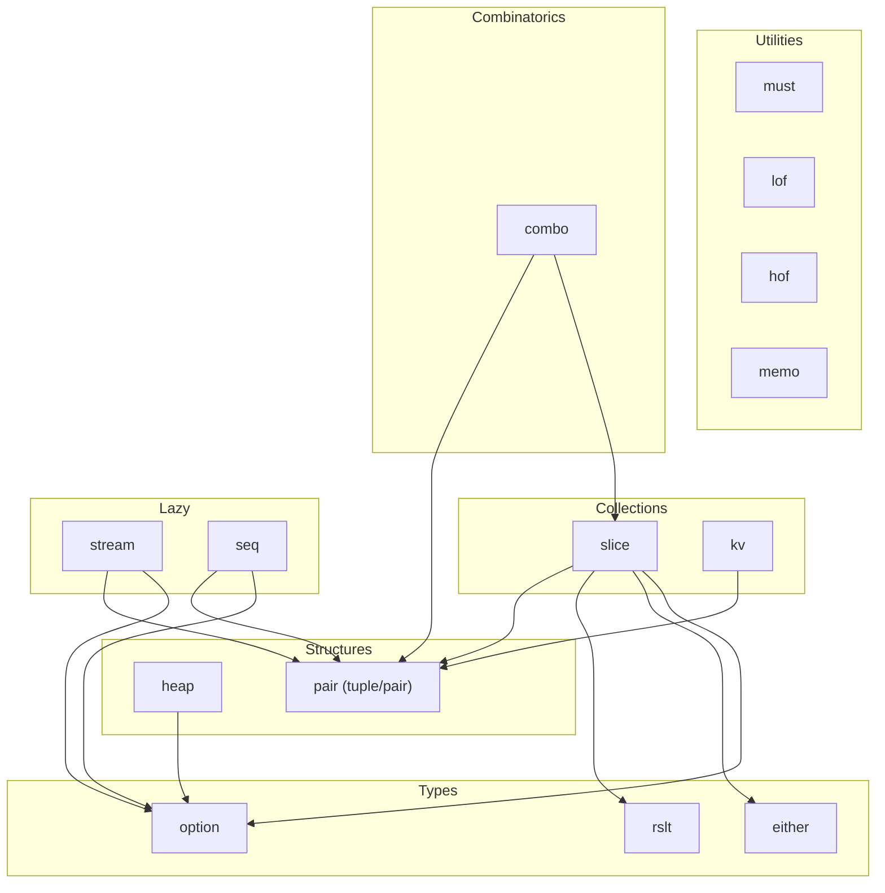

# fluentfp Design

How fluentfp is built. For what it does, see [use-cases.md](use-cases.md). For why this approach, see [analysis.md](../analysis.md).

## Package Structure



| Package | Role |
|---------|------|
| `slice` | Core collection type (`Mapper[T]`) with methods + slice-consuming standalone functions (From, Map, GroupBy, SortBy, Fold, etc.). Implementation lives in `internal/base`. |
| `kv` | Core map type (`Entries[K,V]`) with methods + map-consuming standalone functions (From, Map, MapKeys, MapValues, Values, Keys). Implementation lives in `internal/base`. |
| `option` | Explicit absent-value handling without nil |
| `either` | Two-branch typed alternatives with right-bias |
| `rslt` | Per-item success/failure with `Ok`/`Err` constructors, `PanicError` for recovered panics, `CollectAll`/`CollectOk`/`CollectErr`/`CollectOkAndErr` collectors |
| `stream` | Lazy memoized sequences with per-cell mutex memoization. Head-eager, tail-lazy. Pure sources only. |
| `must` | Panic-on-error enforcement for initialization invariants |
| `pair` | Tuple construction and pairwise slice operations |
| `lof` | Adapters that make Go builtins usable as higher-order function arguments |
| `hof` | Function combinators — composition, partial application, predicates, concurrency control, retry/backoff, debouncing, side-effect wrappers |
| `memo` | Memoization — zero-arg lazy evaluation (`Of`), keyed function caching (`Fn`/`FnErr`), pluggable `Cache` interface with unbounded (`NewMap`) and LRU (`NewLRU`) strategies |
| `heap` | Persistent (immutable) pairing heap parameterized by comparator. Based on Stone Ch 4. O(1) insert/merge, O(log n) amortized delete-min. |
| `combo` | Combinatorial generators — `CartesianProduct`, `Permutations`, `Combinations`, `PowerSet` |
| `seq` | Iterator-native lazy chains wrapping `iter.Seq[T]`. Method chaining via defined type. Re-evaluates (vs stream's memoization). |

Every package uses a `doc.go` containing a `func _()` that references all named exports. This is a compile-time proof that the exports exist — if any are renamed or removed, the build breaks.

## Design Decisions

### D1: Mapper[T] as defined type over []T

```go
type Mapper[T any] []T
```

A defined type with underlying type `[]T` — not a struct wrapper, not a type alias.

**Why:** Convertible to/from `[]T` without allocation. Callers convert with `[]T(mapper)` when passing to standard functions — one explicit conversion, no copy. A defined type (unlike an alias) allows attaching a method set.

**Not a struct wrapper:** would break interop — callers could not convert to `[]T`, use `range` directly, or pass to functions expecting `[]T` without unwrapping.

**Not a type alias:** aliases cannot have methods in Go.

### D3: Specialized terminal types

Extends D1's defined-type approach to terminal slices that need domain-specific methods.

```go
type Float64 []float64   // Sum, Max, Min
type Int    []int         // Sum, Max, Min
type String []string      // Unique, Contains, ContainsAny, Matches, ToSet, NonEmpty
```

Other types remain aliases with no additional methods:

```go
type Any     = Mapper[any]
type Bool    = Mapper[bool]
type Byte    = Mapper[byte]
type Error   = Mapper[error]
type Float32 = Mapper[float32]
type Rune    = Mapper[rune]
```

**Not all defined types:** would add method sets with no terminal operations to justify them.

### D4: Option as value struct

```go
type Option[T any] struct {
    ok bool
    t  T
}
```

Not a pointer, not an interface.

**Why:** Zero value is automatically not-ok (`ok` defaults to `false`). No nil possible. Value semantics mean options can be compared, stored in structs, and returned without heap allocation.

**Not a pointer:** would reintroduce nil — the problem option exists to solve.

**Not an interface:** would require type assertions at extraction, losing the compile-time safety that value types provide.

**Serialization:** Option implements `json.Marshaler`/`Unmarshaler` and `sql.Scanner`/`driver.Valuer`. Both use the same semantics: Ok ↔ value, NotOk ↔ null/NULL. SQL implementation delegates to `sql.Null[T]`, which handles all driver type conversions (int64→int, []byte→string, etc.) and custom Scanner/Valuer delegation internally.

Pre-defined aliases (`String`, `Int`, `Bool`, `Error`) improve readability at usage sites. Pre-declared not-ok values (`NotOkString`, `NotOkInt`, etc.) provide readable sentinel returns — `return option.NotOkString` reads as intent, while `return option.String{}` or `return option.NotOk[string]()` reads as mechanism.

**`Env` naming:** `option.Env` and `must.NonEmptyEnv` — not `Getenv` or `LookupEnv`. Short names that read as intent: `option.Env("PORT").Or("8080")`, `must.NonEmptyEnv("HOME")`. `option.Env` treats unset and empty as absent — the common case. `must.NonEmptyEnv` distinguishes unset from empty in its panic message for diagnostics. For the rare case where empty is a valid explicit value, `option.New(os.LookupEnv(key))` is a one-liner.

For the user-facing case for options over pointers, see [nil-safety.md](../nil-safety.md).

### D5: Either[L,R] with right-bias

```go
type Either[L, R any] struct {
    left    L
    right   R
    isRight bool
}
```

Boolean flag dispatch — Go has no discriminated unions.

**Right-bias:** `Map` and `Get` operate on `Right` (the success side). Convention: Left = failure, Right = success.

**Zero value:** `isRight == false`, so a zero `Either` is Left with zero `L` — a safe default, same pattern as Option's zero being not-ok.

**Not interface-based:** would lose type parameters and require assertion to extract values.

### D6: Conditional value selection

```go
option.When(cond, v)        // eager — v evaluated by Go call semantics
option.WhenFunc(cond, fn)   // lazy — fn called only when cond is true
```

Two standalone functions in `option` with different evaluation strategies. `When` delegates to `New(t, cond)` — it's a readability alias that puts the condition first, matching `if cond` reading order. `WhenFunc` guards a function call behind the condition.

**Why two functions:** the caller picks based on evaluation cost. `When` evaluates eagerly (Go call semantics). `WhenFunc` only calls `fn` when the condition is true.

**Why `When` exists despite being an alias for `New`:** `When` is justified as the eager half of a `When`/`WhenFunc` pair — it makes the eager/lazy distinction discoverable. Without it, callers would need to know that `New` is the eager counterpart to `WhenFunc`, which is not obvious from the names. Style rule: prefer `When` for explicit boolean conditions, `New` for forwarding comma-ok results.

**Eager nil check in WhenFunc:** panics if `fn` is nil even when `cond` is false. This preserves the contract from the predecessor (`value.LazyOf` panicked on nil identically). Branch-dependent bug detection is worse than fail-fast — a nil function is always programmer error regardless of condition.

**What was rejected:**
- *Only `New`*: `New(v, cond)` reads as comma-ok forwarding, not boolean selection. Callers writing `option.New("critical", overdue)` would fight the reading order.
- *Intermediate types (`Cond[T]`/`LazyCond[T]`)*: the old `value.Of(v).When(cond)` DSL required two types with one method each. Standalone functions eliminate the type machinery.
- *Overloading `When` for both eager/lazy*: Go has no function overloading. A single function accepting `any` would lose type safety.
- *Retaining coalesce helpers (`FirstNonZero`, `FirstNonEmpty`)*: these are exactly `cmp.Or` (Go 1.22+ stdlib) for comparable types. `FirstNonNilValue` (pointer dereference) had zero showcase usage and weird semantics — deleted without replacement.

**Migration from `value` package (deleted in v0.40.0):**

| Old | New | Notes |
|-----|-----|-------|
| `value.Of(v).When(cond)` | `option.When(cond, v)` | Condition-first; arg order flipped |
| `value.LazyOf(fn).When(cond)` | `option.WhenFunc(cond, fn)` | Same nil-panic contract |
| `value.FirstNonZero(a, b, ...)` | `cmp.Or(a, b, ...)` | Stdlib; requires `comparable` |
| `value.FirstNonEmpty(a, b, ...)` | `cmp.Or(a, b, ...)` | Stdlib; string-specific variant |
| `value.FirstNonNilValue(p, q, ...)` | No replacement | Pointer-dereference coalesce; zero usage in showcase |
| `value.NonZero`, `value.NonNil`, etc. | `option.NonZero`, `option.NonNil`, etc. | Were already re-exports |

### D7: Must as explicit panic contract

Simple functions that panic on error — no recovery, no try/catch.

**Why:** Go has no structured exception handling (panic/recover is not designed for control flow). `must` is a searchable marker for "this invariant holds or crash."

**Primary use:** initialization sequences where failure means the program cannot proceed. Also supports wrapping functions for repeated enforcement — `must.Of` returns a new function that panics on error.

### D8: lof as builtin adapters

Wraps Go builtins (`len`, `fmt.Println`) as first-class functions for higher-order use.

**Why needed:** Go builtins are not functions — you cannot pass `len` to `.ToInt()`. `lof.Len` bridges the gap.

Also provides `lof.IsNonEmpty` as a predicate for `KeepIf` (filtering non-empty strings), and `lof.IfNonEmpty` which bridges the "empty string = absent" convention to `(string, bool)` for `option.New`.

### D14: hof as function combinators

Provides composition (`Pipe`), partial application (`Bind`/`BindR`), independent application (`Cross`), a standard building block (`Eq`), concurrency control (`Throttle`/`ThrottleWeighted`), side-effect wrappers (`OnErr`), and retry with backoff (`Retry` with `ConstantBackoff`/`ExponentialBackoff`).

**Why needed:** Go functions are values but lack composition operators. `hof` provides the glue that lets developers build new functions from existing ones — for use in fluentfp chains or standalone. `Pipe(trim, toLower)` builds a transform; `Bind(add, 5)` fixes an argument; `Eq(target)` builds a predicate.

**Boundary with lof (D8):** `hof` returns functions (higher-order — operates on functions). `lof` returns values (lower-order — wraps builtins as first-class functions for use in chains). `hof.Pipe` *builds* a transform; `lof.Len` *is* a transform.

**Based on:** Stone's "Algorithms: A Functional Programming Approach" — `Pipe` is left-to-right composition, `Bind`/`BindR` are sections (partial application), `Cross` is independent application.

### D9: Method vs standalone function boundary

Methods on `Mapper[T]` for operations that return chainable types: `KeepIf`, `Convert`, `Find`, `FlatMap`, etc.

Standalone functions for operations needing extra type parameters or custom traversal: `Map`, `FlatMap`, `PFlatMap`, `Fold`, `SortBy`, `MapAccum`, `Unzip`, `FindAs`, `FromSet`, `GroupBy`, `KeyBy`, `Partition`. `GroupBy` lives in the `slice` package — it returns `Mapper[Group[K, T]]` for direct chaining. Map-consuming standalone functions live in `kv` (`kv.Map`, `kv.Values`).

**Why:** Go methods cannot introduce new type parameters. Standalone functions can.

**Consequence:** `Mapper[T]` constrains `T` to `any`, keeping it maximally general. Operations needing `comparable` or `cmp.Ordered` (`SortBy`, `ToSet`, `UniqueBy`, `NonZero`) live as standalone functions where the constraint applies to the key or element, not the receiver.

### D10: Defined type rule

`Mapper[T]`, `Entries[K,V]`, `Float64`, `Int`, `String` are all defined types over their underlying collection (`[]T` or `map[K]V`). Users can range, index, pass to standard functions — the type IS the data. Defined types enable zero-cost conversion to/from the underlying type.

### D11: Result as standalone defined type

```go
type Result[R any] struct {
    value R
    err   error
}
```

A standalone package with zero internal imports — not an alias for `Either[error, R]`.

**Why not an alias for Either:** Either uses Left/Right naming — wrong for a result type where callers want `IsOk()`/`IsErr()`, not `IsRight()`/`IsLeft()`. Changing from alias to defined type later would be contract-breaking. A standalone type can add methods freely (`Convert`, `FlatMap`, `MustGet`, `IfOk`, `IfErr`) without polluting Either's API.

**Zero value:** `Result[R]{}` has `err: nil`, making it a valid `Ok(zeroR)`. Matches D4 (Option zero is not-ok) and D5 (Either zero is Left) in providing useful zero values.

**Lift wraps fallible functions:** `Lift[A, R](fn func(A) (R, error)) func(A) Result[R]` converts a Go-idiomatic `(R, error)` function into one returning `Result[R]`. Mirrors `must.Of` (which wraps to panic-on-error). Single-arg arity covers the common case; multi-arg functions use `rslt.Of(fn(a, b))` directly.

**Collectors return `[]R`:** Plain slices, not `Mapper[R]`. Callers wrap with `slice.From()` for chaining. This keeps `rslt` as a standalone package with zero internal imports — cleaner layering than adding a `slice` dependency.

### D12: Stream as lazy memoized linked list

```go
type Stream[T any] struct { cell *cell[T] }
type cell[T any] struct {
    head  T
    mu    sync.Mutex
    tail  func() *cell[T]  // thunk; nil after successful evaluation
    next  *cell[T]          // memoized result
    state uint8             // pending → evaluating → forced
    wait  chan struct{}      // closed when evaluation completes
}
```

A persistent lazy sequence where each cell's head is eager and tail is lazy, evaluated at most once. Uses a state machine (pending → evaluating → forced) so thunks execute outside the internal mutex. Waiters block on a channel, not on user callback execution. Panicking thunks reset to pending for retry.

**Value type with internal pointer** (follows D4/D5 pattern): zero `Stream` is empty (nil cell). Internal pointer enables shared memoization — two references to the same stream share forced cells.

**Head-eager, tail-lazy:** when a cell exists, its head is known. Only the tail is deferred. Simplifies all operations — no "maybe empty" cells. Works well for pure/in-memory sources; inadequate for effectful/blocking sources (deferred to future phase).

**Not in slice:** Stream is fundamentally different from Mapper (lazy vs eager, linked list vs slice). Separate top-level package with no dependency on `slice`.

**Collect returns `[]T`:** Plain slice, not `Mapper[T]`. Keeps stream independent. Users bridge with `slice.From()`.

**Convert vs Map:** Same D9 constraint as Mapper. `Convert(func(T) T)` is a method (same type). `Map[T,R]` is standalone (cross-type needs extra type param).

**Retention model:** Memoization is the cost of persistence. Holding a reference to an early cell pins all forced suffix cells reachable from it. `From([]T)` closures capture subslice views — can pin the original backing array until those closures are forced or the head becomes unreachable. Niling the tail closure after successful forcing releases the closure and its captures, but does not release the `head` or `next` pointer.

**Panic semantics:** State machine with catch-and-rethrow. If a tail thunk panics, the cell resets to pending and the panic is re-raised (preserving value, not stack trace). Future accesses retry. Callback purity is assumed for deterministic retry. `sync.Once` would permanently poison the cell.

**Reentrancy constraint:** Callbacks must not force the same cell being evaluated (deadlock). This includes indirect paths — e.g., a Map callback that forces the Map result stream. This is inherent to memoized lazy evaluation, not specific to the locking implementation.

**FlatMap, Concat, Zip, Scan:** All standalone (D9 pattern — cross-type parameters). FlatMap reuses KeepIf's scan-forward pattern: eagerly scans outer elements, produces inner streams, and advances until finding a non-empty inner stream for the head. Tail is lazy `Concat(innerTail, FlatMap(outerTail, fn))`. Concat is the lazy analog of slice `append` — a's head with lazy tail `Concat(a.Tail(), b)`. Zip pairs heads with lazy tail `Zip(a.Tail(), b.Tail())`, truncating to shorter. Scan emits initial as head, then lazily accumulates.

### D13: FanOut concurrency model

Channel-based semaphore: `make(chan struct{}, n)` bounds concurrent goroutines.
Each item gets its own goroutine (per-item scheduling), suited for I/O-bound
workloads with variable latency. Panic recovery per item via `runItem` with
named return and defer/recover.

**Why channel, not `x/sync/semaphore`:** Zero external dependencies. Channel
semaphore is O(1) acquire/release for uniform-cost FanOut. For the weighted
variant (multi-token acquire), it's O(cost) — negligible for practical ranges.

**Weighted variant:** `FanOutWeighted` replaces "at most n items" with "at most
capacity units of cost." Each item declares its cost; the scheduler acquires
that many channel tokens before launching. Same cancellation guarantees as
FanOut — partial acquire rolls back on ctx cancellation.

**FanOut vs PMap:** FanOut does per-item scheduling (one goroutine per
item) — optimal for variable-latency I/O. PMap does batch chunking —
lower overhead for CPU-bound uniform work on large slices.

### D15: Throttle as concurrency-controlling function wrapper

`Throttle` and `ThrottleWeighted` wrap a function with concurrency control,
returning a function with the same signature. The returned function blocks
callers until concurrency budget is available.

**Relationship to FanOut (D13):** FanOut processes a batch (slice → results),
managing goroutine lifecycle and recovering panics. Throttle wraps a single
function for streaming use — callers manage their own goroutines. Panics
propagate naturally, consistent with all other hof functions.

**Statefulness:** First stateful hof function — captures a channel semaphore
in the returned closure. Acceptable because the primary operation is still
function wrapping (takes a function, returns a function), and the statefulness
is fully encapsulated — callers interact with a plain function value.

**Acquire serialization (weighted only):** ThrottleWeighted uses a mutex to
serialize the multi-token acquire loop. Without it, N concurrent goroutines
each partially acquiring tokens can fill the channel, deadlocking all of them.
FanOutWeighted avoids this via its sequential scheduling loop. The mutex is
released before fn runs, so fn execution is fully concurrent.

### D16: OnErr as error-triggered side-effect wrapper

`OnErr` wraps a function to call a side-effect (`onErr func(error)`) with the
error after the wrapped function returns a non-nil error. The original result
is returned unchanged — OnErr observes errors, it doesn't handle them.
The error parameter lets handlers classify errors (e.g., refresh token only
on auth errors).

**Function wrapper family:** OnErr shares the `func(ctx, T) (R, error)` →
`func(ctx, T) (R, error)` signature with Throttle/ThrottleWeighted (D15).
All three compose freely in any order: `Throttle(n, OnErr(fn, cancel))`.

**Lifts rslt.IfErr:** rslt.IfErr triggers a side-effect on a Result value.
OnErr does the same at the function boundary — the caller never sees a Result.

**Stateless:** Unlike Throttle (which captures a channel semaphore), OnErr
captures only fn and onErr. No mutable state, no synchronization needed
internally. However, onErr must be safe for concurrent use when the returned
function is called from multiple goroutines.

### D17: pair as standalone tuple package

```go
type Pair[A, B any] struct {
    First  A
    Second B
}
```

A struct with two generic fields — the simplest possible product type.

**Standalone package, zero dependencies:** pair imports nothing — no `slice`,
no `option`. This keeps it lightweight and avoids coupling tuple operations to
collection infrastructure.

**Zip/ZipWith return plain slices:** `Zip` returns `[]Pair[A,B]`, not `Mapper`.
`ZipWith` returns `[]R`, not `Mapper[R]`. This preserves pair's independence from
`slice`. Callers bridge to fluent chains with `slice.From(pair.Zip(...))`.

**Panic on length mismatch:** `Zip` and `ZipWith` panic when inputs differ in
length. This is a precondition violation — the caller asserts the slices
correspond element-by-element. Matches Go convention (index out of bounds panics).
`Zip(nil, nil)` returns an empty slice without panic.

**ZipWith avoids intermediate pairs:** `ZipWith(as, bs, fn)` applies `fn` directly
to corresponding elements without constructing `Pair` values. More efficient than
`Zip` + `Map`, and avoids the uniform-commas tension of nesting
`slice.From(pair.Zip(...)).Map(fn)`.

**Not Triple/Quad/N-tuple:** Pairs cover the dominant use case (two parallel
slices). Higher arities are rare and better served by structs with named fields —
Go has no positional destructuring, so `t.V3` is less readable than `t.Latitude`.

### D18: kv as map-oriented fluent operations

```go
type Entries[K comparable, V any] = base.Entries[K, V]
```

A type alias for `base.Entries[K,V]` — same re-export pattern as `slice.Mapper[T]`
(which aliases `base.Mapper[T]`). The defined type with methods lives in
`internal/base`; the alias re-exports it so callers see the methods through `kv`.
Entries IS the map (indexing, ranging, `len` all work).

**Separate from slice:** Map operations take `map[K]V` input, not `[]T`. Neither
`kv` nor `slice` imports the other. Map-consuming code imports `kv`, slice-consuming
code imports `slice`. Shared implementation flows through `internal/base`.

**From is a type conversion:** `kv.From(m)` is zero-cost — same D1 pattern as
`slice.From`. The `Entries` and the original map share backing data. No copy.

**Cross-type transform:** `kv.Map(m, fn)` infers all types and returns `Mapper[T]`.

**MapValues preserves map structure:** `MapValues(m, fn)` returns `Entries[K, V2]` —
keys preserved, values transformed. Enables chains like
`kv.MapValues(raw, parse).KeepIf(isValid).Values()` without losing the map context
until the caller is ready to extract.

**MapKeys is symmetric with MapValues:** `MapKeys(m, fn)` returns `Entries[K2, V]` — values preserved, keys transformed. Last-wins on key collision, consistent with `Merge` and `FromPairs`.

**KeepIf/RemoveIf on Entries:** Filter map entries by a `func(K, V) bool` predicate,
returning `Entries` for further chaining. Mirrors `Mapper.KeepIf`/`RemoveIf` but
with both key and value available to the predicate.

**pair dependency:** `ToPairs`/`FromPairs` introduce `kv → pair`. `pair` has zero
imports and cannot create cycles. The alternative (duplicating Pair in `kv` or using
`[2]any`) is worse than a clean edge to a leaf package.

### D19: memo — Memoization as state machine

```go
type ofCell[T any] struct {
    mu     sync.Mutex
    fn     func() T
    result T
    state  uint8       // pending → evaluating → forced
    wait   chan struct{}
}
```

Mirrors stream's D12 cell pattern: same three-state machine (pending → evaluating → forced), same channel-based waiter notification, same panic semantics (reset to pending for retry). The `fn` field is nil'd after success to release the closure for GC.

**Retry-on-panic vs sync.Once:** `sync.Once` permanently poisons on panic — the function never runs again and callers silently get a zero value. `memo.Of` resets to pending, re-raises the panic, and lets future callers retry. This matches stream's behavior and is correct for transient failures.

**Pluggable Cache interface:** `Cache[K, V]` is `Load(K) (V, bool)` + `Store(K, V)`. Two built-in strategies: `NewMap` (unbounded, `sync.RWMutex` + map) and `NewLRU` (bounded, eviction by least recently used). Custom strategies implement the same interface.

**FnErr caches successes only:** Errors are transient — caching them would prevent retry when the underlying condition resolves. Only successful `(V, nil)` results are stored; `(V, error)` results pass through uncached.

**No fluentfp deps:** `memo` depends only on `sync` and `container/list`. No coupling to option, slice, or any other fluentfp package.

### D20: heap — Persistent pairing heap

```go
type Heap[T any] struct {
    root *node[T]
    cmp  func(T, T) int
    size int
}
```

A persistent (immutable) priority queue based on Stone's Algorithms for Functional Programming Ch 4. The pairing merge strategy (Stone's heap-list-merger) gives O(1) insert and merge with O(log n) amortized delete-min.

**Immutable:** `Insert`, `DeleteMin`, and `Merge` return new heaps; the original is unchanged. This follows fluentfp's immutability-by-default invariant and enables safe sharing across goroutines without synchronization.

**Comparator-parameterized:** `heap.New(cmp)` takes a `func(T, T) int` comparator, compatible with `slice.Asc` and `slice.Desc` builders. Min-heap or max-heap is a constructor choice, not a type distinction.

**No `container/heap` interface:** The stdlib interface requires push/pop mutation, which contradicts persistent semantics. `Heap[T]` provides its own API: `Insert`, `DeleteMin`, `Merge`, `Min`, `Pop`, `Collect`.

**Min returns `option.Option[T]`:** Same absence-is-normal pattern as `Mapper.Find` — an empty heap is not an error. `Pop` uses comma-ok instead (returns both the min and the remaining heap — richer than a single Option).

### D21: combo — Combinatorial generators

```go
func CartesianProduct[A, B any](a []A, b []B) slice.Mapper[pair.Pair[A, B]]
func Permutations[T any](items []T) slice.Mapper[[]T]
func Combinations[T any](items []T, k int) slice.Mapper[[]T]
func PowerSet[T any](items []T) slice.Mapper[[]T]
```

Standalone functions that generate combinatorial constructions as `slice.Mapper`, enabling direct chaining (e.g., `Permutations(items).KeepIf(pred)`).

**CartesianProductWith avoids intermediate allocation:** `CartesianProductWith(a, b, fn)` applies `fn` directly to each (a, b) pair without constructing `pair.Pair` values. More efficient when the caller transforms immediately.

**Dependencies:** `pair` for `CartesianProduct`'s element type, `slice` for the `Mapper` return type.

### D22: seq — Iterator-native fluent chains

```go
type Seq[T any] iter.Seq[T]
```

A defined type over `iter.Seq[T]` that enables method chaining — the same trick D1 uses for `Mapper[T]` over `[]T`. Wrapping `iter.Seq[T]` as a named type adds methods without changing the representation.

**Re-evaluates on each iteration:** Unlike stream's memoized cells, seq pipelines re-evaluate every time they are ranged or collected. This is standard `iter.Seq` semantics — no hidden caching, no memoization overhead, no retention of intermediate results.

**Bridges Go 1.23+ range protocol:** `for v := range seq.From(data).KeepIf(pred) { ... }` works directly. `.Iter()` unwraps back to `iter.Seq[T]` for interop with stdlib and other libraries.

**Convert vs Map:** Same D9 constraint as Mapper and Stream. `Convert(func(T) T)` is a method (same type). `Map[T, R]` is standalone (cross-type needs an extra type parameter that Go can't infer from the receiver).

**Find returns `option.Option[T]`:** Same absence-is-normal pattern as `Mapper.Find` and `Stream.Find`.

**FlatMap, Concat, Zip, Scan:** All standalone (D9 pattern). FlatMap takes `func(T) Seq[R]` — inner sequences are lazy Seqs, not slices. Concat yields all of `a` then all of `b` via sequential range loops. Scan emits initial then lazily accumulates. Zip is the first use of `iter.Pull` in the codebase — ranges over `a` and Pulls `b` for lockstep iteration (one goroutine, not two). `defer stop()` required to release the Pull goroutine on early termination.

**FilterMap, Contains, Chunk, Unique, UniqueBy:** All standalone (D9 pattern — either need extra type params, comparable constraints, or cause Go instantiation cycles). FilterMap combines filtering and cross-type transformation with a comma-ok callback. Contains needs `comparable` on `T` (can't express on `Seq[T any]` receiver). Unique/UniqueBy need `comparable` on `T` or key type `K`. Chunk must be standalone because `Seq[T].Chunk() Seq[[]T]` causes a Go instantiation cycle (`T` instantiated as `[]T`).

**Intersperse, Reduce:** Methods (D9 pattern — unary, no extra params or constraints). Intersperse inserts a separator between adjacent elements with O(1) state. Reduce is a terminal that uses the first element as the initial accumulator value, returning `option.Option[T]` (empty sequence → not-ok). Reduce panics on nil fn unconditionally — diverges from `slice.Reduce` which tolerates nil fn on 0-1 elements, but matches the seq package contract where all nil callbacks panic.

**Re-iteration safety for stateful operations:** Unique, UniqueBy, Chunk, and Intersperse allocate state (seen maps, buffers, flags) inside the `func(yield)` closure, not at construction time. Each iteration starts with fresh state. However, repeated iteration re-evaluates the source — if the source is stateful or effectful, results may differ.

### D23: Retry as retry-on-error function wrapper

`Retry` wraps a function to retry on error with configurable backoff,
returning a function with the same `func(context.Context, T) (R, error)`
signature as Throttle and OnErr.

```go
type Backoff func(n int) time.Duration

func Retry[T, R any](maxAttempts int, backoff Backoff, shouldRetry func(error) bool, fn func(context.Context, T) (R, error)) func(context.Context, T) (R, error)
```

**Function wrapper family:** Retry shares the same signature as Throttle (D15)
and OnErr (D16). All three compose freely: `Throttle(n, Retry(3, backoff, shouldRetry, fn))`.

**Retry predicate:** `shouldRetry func(error) bool` controls which errors trigger
a retry. When non-nil, errors for which `shouldRetry` returns false are returned
immediately without backoff. When nil, all errors are retried — this is the only
nil parameter that doesn't panic, chosen because "retry everything" is the common
case and requiring a `func(_ error) bool { return true }` for it would be noise.

**Backoff as function type:** `Backoff func(n int) time.Duration` — not an
interface. Takes the zero-based attempt number, returns a delay. Two built-in
constructors: `ConstantBackoff(delay)` returns fixed delay, `ExponentialBackoff(initial)`
returns random delay in `[0, initial * 2^n)` (full jitter per AWS architecture
blog). Custom strategies are plain functions.

**Full jitter for ExponentialBackoff:** `rand.N(initial << n)` from `math/rand/v2`.
Full jitter (random in full range) outperforms equal jitter and decorrelated
jitter for contention reduction. Overflow guard: if `initial << n` overflows
(negative or zero), clamp to `math.MaxInt64`.

**Context-aware sleep:** Between attempts, `Retry` uses `time.NewTimer` + `select`
on both the timer and `ctx.Done()`. Context cancellation during backoff returns
`ctx.Err()` immediately. Context is also checked before each attempt.

**Stateless:** Unlike Throttle (which captures a channel semaphore), Retry
captures only `maxAttempts`, `backoff`, `shouldRetry`, and `fn`. Each call to
the returned function is independent — no shared retry state between concurrent
callers.

**Panics on invalid args:** `maxAttempts < 1`, `nil backoff`, `nil fn` all
panic. Same contract as `ExponentialBackoff(initial <= 0)`. These are
programming errors, not runtime conditions.

### D24: Debouncer as stateful coalescing scheduler

`Debouncer[T]` is the first struct-based API in `hof`, breaking the transparent
function decorator pattern used by Throttle, OnErr, and Retry.

```go
type Debouncer[T any] struct { /* unexported */ }

func NewDebouncer[T any](wait time.Duration, fn func(T), opts ...DebounceOption) *Debouncer[T]
func (d *Debouncer[T]) Call(v T)
func (d *Debouncer[T]) Cancel() bool
func (d *Debouncer[T]) Flush() bool
func (d *Debouncer[T]) Close()
```

**Why not `func(context.Context, T) (R, error)`:** Debounce collapses many calls
into one execution. A request/response function implies each call maps to its own
result — those semantics are fundamentally at odds. Returning `ErrDebounced` for
swallowed calls makes the decorator non-transparent; blocking callers until eventual
execution gives earlier callers a result for input they didn't submit; returning
zero values is silent loss. Breaking the pattern is the honest choice.

**Why `func(T)` not `func()`:** Most debounced work depends on the latest value
(autosave latest state, search latest query, flush latest config). `func()` forces
callers to capture mutable external state, which is race-prone and awkward.

**Why a struct not a closure:** The multi-method interface (Call, Cancel, Flush, Close)
cannot be expressed as a returned function. A struct provides clear lifecycle, better
discoverability, and room for future extension.

**Owner goroutine architecture:** A single goroutine owns all mutable state — pending
value, timers, running flag. External methods communicate via channels. This eliminates
timer races by construction (no stale AfterFunc callbacks), avoids per-Call allocations
(single reusable `time.Timer` with Reset), and makes Flush/Cancel linearization trivial
(events processed sequentially in select). Trade-off: requires Close for goroutine
lifecycle. Benchmarks: 0 allocs/op for Call under both sequential and concurrent load.

**Serialization:** At most one `fn` execution at a time. fn runs in a spawned goroutine
with deferred completion signaling. Calls during execution queue the latest value for
a fresh timer cycle after completion.

**MaxWait option:** Without MaxWait, continuous calls defer indefinitely (starvation).
MaxWait caps the maximum delay — the timer runs from the first call in a burst and
is not reset by subsequent calls. Fresh MaxWait timer starts on each new burst.

**Flush semantics:** Flush binds to the pending work visible at the moment it is called.
New Calls that arrive during a flushed execution do not extend the Flush — they are
scheduled normally via timer. Only one Flush waiter is supported; subsequent calls return
false immediately. Internally, a `flushTarget` flag tracks whether the currently running
execution is the one the Flush waiter is waiting for, preventing indefinite cascading.

**Reentrancy:** Call and Cancel are safe from within fn (channel send, owner processes
while fn is running). Flush and Close from within fn deadlock — fn completion must signal
before either can proceed. Documented as unsupported.

**Panic behavior:** fn runs in a spawned goroutine. Panics propagate normally (crash
the process). The deferred doneCh signal preserves owner goroutine state invariants
before the panic continues.

### D25: Channel adapters — FromChannel and ToChannel

`FromChannel` and `ToChannel` bridge Go channels and `Seq[T]` iterators.

```go
func FromChannel[T any](ctx context.Context, ch <-chan T) Seq[T]
func (s Seq[T]) ToChannel(ctx context.Context, buf int) <-chan T
```

**Why context on both:** Channels are inherently concurrent. `FromChannel` can block
forever on an unclosed channel; `ToChannel` spawns a goroutine. Context is the standard
Go mechanism for cancellation in concurrent code. These are the first `seq` APIs to
accept `context.Context`, reflecting their concurrent nature. Only adapters that block
on external concurrent sources or spawn goroutines accept context; pure in-memory
combinators remain context-free.

**Cancellation is cooperative, not preemptive:** `iter.Seq` is push-based — the producer
calls `yield` and the consumer can only signal stop by returning false. Context can only
be checked at yield/send boundaries. If the upstream Seq blocks internally before
yielding (e.g., a nested `FromChannel` on a slow source), `ToChannel`'s goroutine
remains blocked until the source yields or terminates. This asymmetry is inherent to
`iter.Seq`'s protocol.

**Best-effort semantics:** When `ctx.Done()` and a data case are both ready, Go's
`select` picks pseudo-randomly. This can happen repeatedly across loop iterations, so
the adapter may yield/send zero, one, or many additional values after cancellation
before the `ctx.Done()` branch is selected. The only guarantee: once cancellation is
observed by selecting the `ctx.Done()` branch, iteration stops.

**Context capture in FromChannel:** `FromChannel` captures `ctx` in the returned Seq
for its lifetime. Unlike most Go APIs, cancellation scope is fixed at construction
time, not iteration time. A Seq constructed with a request-scoped context and iterated
later may already be canceled.

**ToChannel as method:** Enables fluent chaining:
`seq.FromChannel(ctx, ch).KeepIf(pred).Take(10).ToChannel(ctx, 1)`.
`FromChannel` is a standalone constructor (like `From`, `FromNext`).

**Nil Seq on ToChannel returns closed empty channel:** Consistent with the nil-receiver
pattern across all Seq methods (`Collect()` → nil, `Find()` → not-ok).

**No FanIn via Concat:** `Concat` is sequential concatenation — it drains the first
sequence completely before starting the second. This is not fan-in (multiplexing).
True fan-in requires a distinct combinator with concurrent goroutines, deferred to a
future release.

**Re-iteration is stateful:** Like `FromNext`, `FromChannel` wraps a stateful source.
Second iteration continues from whatever channel state exists, not from the beginning.

## Allocation Model

**Entry and exit are free:** `slice.From()` and returning `Mapper[T]` as `[]T` are type conversions — the Go spec guarantees they only change the type, not the representation. No array copy; the slice header (pointer, length, capacity) is reinterpreted. The backing array is shared.

**Every transformation creates a fresh slice** — eager allocation, not lazy.

**Why not lazy:** eager allocation is predictable (no hidden evaluation order), debuggable (intermediate slices visible in the debugger), and simple (no iterator protocol). The cost is extra allocations in multi-step chains.

**Exceptions:** `Take` and `TakeLast` return subslice views — no allocation.

**Cost model:** a chain of N operations produces N allocations. A single fused loop produces 1. For benchmarks and empirical cost analysis, see [methodology.md §I](../methodology.md#i-performance-analysis).

### Boundaries and Defensive Copying

In practice, fluentfp code lives alongside imperative code — legacy libraries, third-party APIs, team code that doesn't use fluentfp. The shared backing array from `From()` and subslice views from `Take`/`TakeLast`/`Chunk` create mutation boundaries worth understanding.

**Quick reference — shares backing array or independent?**

| Operation | Backing Array | Clone needed at mutation boundary? |
|-----------|--------------|-----------------------------------|
| `From()` alone | Shared | Yes, if either side mutates |
| `Take`, `TakeLast` | Shared (subslice view) | Yes, if result is mutated or outlives source |
| `Chunk` | Shared (each chunk is a view) | Yes, if chunks are mutated |
| Everything else (`KeepIf`, `RemoveIf`, `Convert`, `ToString`, `Reverse`, `FlatMap`, `SortBy`, `Map`, `Clone`, etc.) | Independent (fresh allocation) | No |

Most chains are safe by default — any allocating operation produces an independent result:

```go
// Safe: KeepIf allocates a new slice. Mutating users later won't affect actives.
actives := slice.From(users).KeepIf(User.IsActive)
```

**When to think about it:**

1. **`From()` alone** — if you store the `Mapper[T]` without chaining an allocating operation, it shares the original's backing array. If anything later mutates the original — your own code, a caller, a library function — the Mapper sees it.

```go
m := slice.From(users)   // shares backing array with users
sort.Slice(users, ...)   // m is now also sorted — probably not what you want
```

This is especially relevant when receiving slices from other code. The caller may retain and mutate the slice after you've wrapped it:

```go
func processUsers(users []User) {
    cached := slice.From(users)  // shares backing array
    // ... if the caller sorts or overwrites users later, cached reflects it
}
```

Fix: chain an allocating operation (`m := slice.From(users).Clone()`) or accept that the Mapper is a view, not a snapshot.

2. **`Take`/`TakeLast`/`Chunk`** — these return subslice views (no allocation). The result shares the original's backing array. Safe for read-only use; risky if the result or source is later mutated or appended to.

```go
first5 := slice.From(users).Take(5)   // subslice view
// Appending to first5 may overwrite users[5] if capacity remains
```

Fix: `.Take(5).Clone()` when the result will be mutated or outlive the source.

3. **Passing results to code that mutates in place** — if a third-party function sorts, shuffles, or overwrites elements of a slice you pass it, and you still need the original order, clone first. This only matters for view operations — allocating operations already produce independent slices.

```go
// Take returns a view — clone before handing to mutating code
batch := slice.From(items).Take(10).Clone()
legacySort(batch)  // safe — batch has independent backing array

// KeepIf already allocates — no clone needed
filtered := slice.From(items).KeepIf(Item.IsValid)
legacySort(filtered)  // safe — KeepIf already produced a fresh slice
```

**Rule of thumb:** If a chain contains at least one allocating operation (`KeepIf`, `Convert`, `ToString`, etc.), the result already has an independent backing array. `.Clone()` is only needed at boundaries where (a) you used only view operations (`From` alone, `Take`, `TakeLast`, `Chunk`) and (b) either side might mutate.

## Safety Properties

### Nil safety

Internal library strategy. For the user-facing case for options, see [nil-safety.md](../nil-safety.md).

All collection and option operations handle nil input without panic:

- `Fold` returns the initial value
- `SortBy`, `Unzip`, `MapAccum`, `UniqueBy` produce empty results
- `Find`, `FindAs` return not-ok options
- Parallel operations early-return on empty input

**Why:** matches the Go idiom where `len(nil) == 0` and `range nil` iterates zero times.

**Clone** preserves nil (nil in, nil out) — deliberate, maintains the caller's nil/empty distinction.

**FlatMap** always returns non-nil. The standalone, `PFlatMap`, and `Mapper` implementations all use `make([]T, 0, ...)`, so the result is non-nil even when no elements are produced.

**Exception:** `pair.Zip` and `pair.ZipWith` panic on length mismatch. This is a precondition violation, not a nil issue — `Zip(nil, nil)` returns an empty slice without panic.

### Thread safety

All transformations return new slices with no shared mutable state. Safe for concurrent reads on the same `Mapper`. Concurrent writes require external synchronization — same as plain Go slices.

### Zero-value usability

All exported types are zero-value safe:

- Zero `Mapper` is a nil slice — valid for `range` and `len`
- Zero `Option[T]` is not-ok — safe to call `Or`, `OrZero`, `Get`
- Zero `Either` is Left with zero `L` — safe to call `Get`, `Or`, `IsRight`
- Zero `Cond`/`LazyCond` produce not-ok from `.When()`

## Cross-Package Connections

Where packages depend on each other, and why:

| Connection | Why |
|------------|-----|
| `Mapper.Find` → `option.Option[T]` | Absence is the expected case, not an error. Option provides richer extraction (`Or`, `OrZero`, `IfOk`) vs bare comma-ok. |
| `Mapper.First` → `option.Option[T]` | Same: empty collection is normal, not exceptional. |
| `Mapper.IndexWhere` → `option.Option[int]` | Same: no match is normal, not exceptional. |
| `Mapper.Sample` → `option.Option[T]` | Same: empty collection is normal, not exceptional. |
| `FindAs[R,T]` → `option.Option[R]` | Type-assertion search where absence and type mismatch both mean "not found." |
| `Mapper.Single` → `either.Either[int, T]` | Failure carries information (the actual count). A plain error would discard it. |
| `option.When` → `option.Option[T]` | Conditional construction reusing option's `Or`/`OrZero` extraction. |
| `Entries.Values` → `Mapper[V]` | Bridges map values into slice pipelines. Used by `kv.From(m).Values()` for map-to-slice conversion. |
| `FanOut` → `rslt.Result[R]` | Per-item results for concurrent traversal. `Mapper[Result[R]]` preserves chainability — callers filter, partition, or collect results using existing Mapper methods. |
| `FanOut` → `rslt.PanicError` | Recovered panics wrapped as errors. `errors.As(err, &pe)` detects panic-originated failures. Preserves error chains via `Unwrap()`. |
| `Stream.First` → `option.Option[T]` | Same pattern as `Mapper.First` — absence is normal, not exceptional. |
| `Stream.Find` → `option.Option[T]` | Same pattern as `Mapper.Find` — no match is normal. |
| `Heap.Min` → `option.Option[T]` | Same pattern as `Mapper.Find` — empty heap is normal, not exceptional. |
| `Seq.Find` → `option.Option[T]` | Same pattern — no match is normal. |
| `Seq.Reduce` → `option.Option[T]` | Same pattern — empty sequence is normal, not exceptional. |
| `CartesianProduct` → `pair.Pair[A,B]` | Natural representation of element pairs from two collections. |
| `kv.ToPairs` → `pair.Pair[K,V]` | Pairs are the natural representation of map entries as a flat sequence. Using pair avoids duplicating a struct in kv. |

`hof`, `lof`, `must`, `pair`, and `memo` have no fluentfp dependency. `combo` depends on `pair` and `slice`. `stream`, `seq`, and `heap` depend only on `option`. `slice` depends on `option`, `either`, `rslt`, and `pair`; `kv` depends on `pair` — neither `kv` nor `slice` imports the other.

**Option vs Either boundary:** option models presence/absence (one type, might not exist). Either models two typed outcomes where both branches carry information (Left = failure with context, Right = success). Use option when absence needs no explanation; either when the failure case has data the caller needs.
