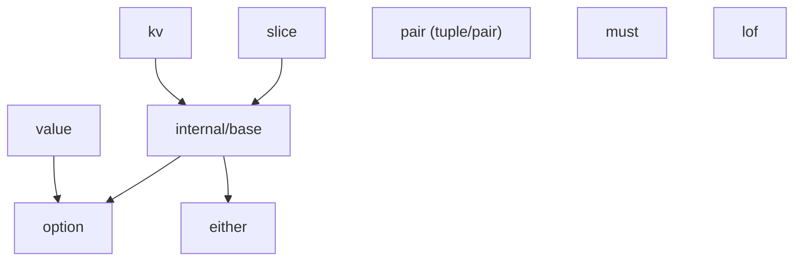

# fluentfp Design

How fluentfp is built. For what it does, see [use-cases.md](use-cases.md). For why this approach, see [analysis.md](../analysis.md).

## Package Structure



| Package | Role |
|---------|------|
| `internal/base` | Core types (`Mapper`, `MapperTo`, `Entries`, `Float64`, `Int`, `String`) and all their methods. Hidden from external consumers. |
| `slice` | Type aliases for base types + slice-consuming standalone functions (From, Map, GroupBy, SortBy, Fold, etc.) |
| `kv` | Type alias for `Entries` + map-consuming standalone functions (From, Map, MapTo, Values, Keys) |
| `option` | Explicit absent-value handling without nil |
| `either` | Two-branch typed alternatives with right-bias |
| `must` | Panic-on-error enforcement for initialization invariants |
| `value` | Conditional value selection with eager/lazy evaluation |
| `pair` | Tuple construction and pairwise slice operations |
| `lof` | Adapters that make Go builtins usable as higher-order function arguments |

Every package uses a `doc.go` containing a `func _()` that references all named exports. This is a compile-time proof that the exports exist — if any are renamed or removed, the build breaks.

## Design Decisions

### D1: Mapper[T] as defined type over []T

```go
type Mapper[T any] []T
```

A defined type with underlying type `[]T` — not a struct wrapper, not a type alias.

**Why:** Convertible to/from `[]T` without allocation. Callers convert with `[]T(mapper)` when passing to standard functions — one explicit conversion, no copy. A defined type (unlike an alias) allows attaching a method set.

**Not a struct wrapper:** would break interop — callers could not convert to `[]T`, use `range` directly, or pass to functions expecting `[]T` without unwrapping.

**Not a type alias:** aliases cannot have methods in Go.

### D2: MapperTo[R,T] for arbitrary type mapping

```go
type MapperTo[R, T any] []T
```

Carries target type `R` at the type level. `R` does not appear in the slice representation but controls the return type of `.Map()`.

**Why it exists:** Go methods cannot declare type parameters beyond those on the receiver type. A method like `.Map[R](fn func(T) R) Mapper[R]` is illegal — the extra type parameter must come from the type, not the method. `MapperTo` binds `R` at construction time via `slice.MapTo[R](ts)`.

**Prefer `slice.Map` for most cross-type mapping.** The standalone `slice.Map(ts, fn)` infers all types and returns `Mapper[R]` for further chaining. `MapperTo` is only needed when you filter or transform *before* the cross-type map: `slice.MapTo[R](ts).KeepIf(pred).Map(fn)`.

### D3: Specialized terminal types

Extends D1's defined-type approach to terminal slices that need domain-specific methods.

```go
type Float64 []float64   // Sum, Max, Min
type Int    []int         // Sum, Max, Min
type String []string      // Unique, Contains, ContainsAny, Matches, ToSet
```

Other types remain aliases with no additional methods:

```go
type Any     = Mapper[any]
type Bool    = Mapper[bool]
type Byte    = Mapper[byte]
type Error   = Mapper[error]
type Float32 = Mapper[float32]
type Rune    = Mapper[rune]
```

**Not all defined types:** would add method sets with no terminal operations to justify them.

### D4: Option as value struct

```go
type Option[T any] struct {
    ok bool
    t  T
}
```

Not a pointer, not an interface.

**Why:** Zero value is automatically not-ok (`ok` defaults to `false`). No nil possible. Value semantics mean options can be compared, stored in structs, and returned without heap allocation.

**Not a pointer:** would reintroduce nil — the problem option exists to solve.

**Not an interface:** would require type assertions at extraction, losing the compile-time safety that value types provide.

Pre-defined aliases (`String`, `Int`, `Bool`, `Error`) improve readability at usage sites. For the user-facing case for options over pointers, see [nil-safety.md](../nil-safety.md).

### D5: Either[L,R] with right-bias

```go
type Either[L, R any] struct {
    left    L
    right   R
    isRight bool
}
```

Boolean flag dispatch — Go has no discriminated unions.

**Right-bias:** `Map` and `Get` operate on `Right` (the success side). Convention: Left = failure, Right = success.

**Zero value:** `isRight == false`, so a zero `Either` is Left with zero `L` — a safe default, same pattern as Option's zero being not-ok.

**Not interface-based:** would lose type parameters and require assertion to extract values.

### D6: Value selection as type chain

```go
type Cond[T any] struct{ v T }
type LazyCond[T any] struct{ fn func() T }
```

Two types with identical fluent chain shape (`.When(bool).Or(T)`) but different constructors (`Of(T)` vs `LazyOf(func() T)`).

**Why two types:** the caller picks based on evaluation cost. `Cond` evaluates the value eagerly. `LazyCond` never evaluates the function unless the condition is true — the unused branch's computation is never performed.

**Not a single function with bool parameter:** loses the fluent `Of(v).When(c).Or(d)` readability.

### D7: Must as explicit panic contract

Simple functions that panic on error — no recovery, no try/catch.

**Why:** Go has no structured exception handling (panic/recover is not designed for control flow). `must` is a searchable marker for "this invariant holds or crash."

**Primary use:** initialization sequences where failure means the program cannot proceed. Also supports wrapping functions for repeated enforcement — `must.Of` returns a new function that panics on error.

### D8: lof as builtin adapters

Wraps Go builtins (`len`, `fmt.Println`) as first-class functions for higher-order use.

**Why needed:** Go builtins are not functions — you cannot pass `len` to `.ToInt()`. `lof.Len` bridges the gap.

Also provides `lof.IsNonEmpty` as a predicate for `KeepIf` (filtering non-empty strings), and `lof.IfNonEmpty` which bridges the "empty string = absent" convention to `(string, bool)` for `option.New`.

### D9: Method vs standalone function boundary

Methods on `Mapper[T]` for operations that return chainable types: `KeepIf`, `Convert`, `Find`, `FlatMap`, etc.

Standalone functions for operations needing extra type parameters or custom traversal: `Fold`, `SortBy`, `MapAccum`, `Unzip`, `FindAs`, `FromSet`, `GroupBy`. `GroupBy` lives in the `slice` package — it returns `Mapper[Group[K, T]]` for direct chaining. Map-consuming standalone functions live in `kv` (`kv.Values`, `kv.MapTo[T]`).

**Why:** Go methods cannot introduce new type parameters (the D2 constraint). Standalone functions can.

**Consequence:** `Mapper[T]` constrains `T` to `any`, keeping it maximally general. Operations needing `comparable` or `cmp.Ordered` (`SortBy`, `ToSet`, `UniqueBy`) live as standalone functions where the constraint applies to the key, not the element.

### D10: Defined type vs struct wrapper rule

**If it IS the collection → defined type. If it wraps for transformation → struct.**

`Mapper[T]`, `Entries[K,V]`, `Float64`, `Int`, `String` are all defined types over their underlying collection (`[]T` or `map[K]V`). Users can range, index, pass to standard functions — the type IS the data.

`MapperTo[R,T]`, `EntryMapper[T,K,V]` are struct wrappers. They carry extra type information (`R` or `T`) that doesn't appear in the underlying data. The struct exists to bind the extra type parameter, not to represent the collection.

**Why it matters:** Defined types enable zero-cost conversion to/from the underlying type. Struct wrappers break this — but they're only used for intermediate transformation types that are consumed immediately (`.Map(fn)`).

## Allocation Model

**Entry and exit are free:** `slice.From()` and returning `Mapper[T]` as `[]T` are type conversions — the Go spec guarantees they only change the type, not the representation. No array copy; the slice header (pointer, length, capacity) is reinterpreted. The backing array is shared.

**Every transformation creates a fresh slice** — eager allocation, not lazy.

**Why not lazy:** eager allocation is predictable (no hidden evaluation order), debuggable (intermediate slices visible in the debugger), and simple (no iterator protocol). The cost is extra allocations in multi-step chains.

**Exceptions:** `Take` and `TakeLast` return subslice views — no allocation.

**Cost model:** a chain of N operations produces N allocations. A single fused loop produces 1. For benchmarks and empirical cost analysis, see [methodology.md §I](../methodology.md#i-performance-analysis).

### Boundaries and Defensive Copying

In practice, fluentfp code lives alongside imperative code — legacy libraries, third-party APIs, team code that doesn't use fluentfp. The shared backing array from `From()` and subslice views from `Take`/`TakeLast`/`Chunk` create mutation boundaries worth understanding.

**Quick reference — shares backing array or independent?**

| Operation | Backing Array | Clone needed at mutation boundary? |
|-----------|--------------|-----------------------------------|
| `From()` alone | Shared | Yes, if either side mutates |
| `Take`, `TakeLast` | Shared (subslice view) | Yes, if result is mutated or outlives source |
| `Chunk` | Shared (each chunk is a view) | Yes, if chunks are mutated |
| Everything else (`KeepIf`, `RemoveIf`, `Convert`, `ToString`, `Reverse`, `FlatMap`, `SortBy`, `Map`, `Clone`, etc.) | Independent (fresh allocation) | No |

Most chains are safe by default — any allocating operation produces an independent result:

```go
// Safe: KeepIf allocates a new slice. Mutating users later won't affect actives.
actives := slice.From(users).KeepIf(User.IsActive)
```

**When to think about it:**

1. **`From()` alone** — if you store the `Mapper[T]` without chaining an allocating operation, it shares the original's backing array. If anything later mutates the original — your own code, a caller, a library function — the Mapper sees it.

```go
m := slice.From(users)   // shares backing array with users
sort.Slice(users, ...)   // m is now also sorted — probably not what you want
```

This is especially relevant when receiving slices from other code. The caller may retain and mutate the slice after you've wrapped it:

```go
func processUsers(users []User) {
    cached := slice.From(users)  // shares backing array
    // ... if the caller sorts or overwrites users later, cached reflects it
}
```

Fix: chain an allocating operation (`m := slice.From(users).Clone()`) or accept that the Mapper is a view, not a snapshot.

2. **`Take`/`TakeLast`/`Chunk`** — these return subslice views (no allocation). The result shares the original's backing array. Safe for read-only use; risky if the result or source is later mutated or appended to.

```go
first5 := slice.From(users).Take(5)   // subslice view
// Appending to first5 may overwrite users[5] if capacity remains
```

Fix: `.Take(5).Clone()` when the result will be mutated or outlive the source.

3. **Passing results to code that mutates in place** — if a third-party function sorts, shuffles, or overwrites elements of a slice you pass it, and you still need the original order, clone first. This only matters for view operations — allocating operations already produce independent slices.

```go
// Take returns a view — clone before handing to mutating code
batch := slice.From(items).Take(10).Clone()
legacySort(batch)  // safe — batch has independent backing array

// KeepIf already allocates — no clone needed
filtered := slice.From(items).KeepIf(Item.IsValid)
legacySort(filtered)  // safe — KeepIf already produced a fresh slice
```

**Rule of thumb:** If a chain contains at least one allocating operation (`KeepIf`, `Convert`, `ToString`, etc.), the result already has an independent backing array. `.Clone()` is only needed at boundaries where (a) you used only view operations (`From` alone, `Take`, `TakeLast`, `Chunk`) and (b) either side might mutate.

## Safety Properties

### Nil safety

Internal library strategy. For the user-facing case for options, see [nil-safety.md](../nil-safety.md).

All collection and option operations handle nil input without panic:

- `Fold` returns the initial value
- `SortBy`, `Unzip`, `MapAccum`, `UniqueBy` produce empty results
- `Find`, `FindAs` return not-ok options
- Parallel operations early-return on empty input

**Why:** matches the Go idiom where `len(nil) == 0` and `range nil` iterates zero times.

**Clone** preserves nil (nil in, nil out) — deliberate, maintains the caller's nil/empty distinction.

**FlatMap** always returns non-nil. Both `Mapper` and `MapperTo` implementations use `make([]T, 0, ...)`, so the result is non-nil even when no elements are produced.

**Exception:** `pair.Zip` and `pair.ZipWith` panic on length mismatch. This is a precondition violation, not a nil issue — `Zip(nil, nil)` returns an empty slice without panic.

### Thread safety

All transformations return new slices with no shared mutable state. Safe for concurrent reads on the same `Mapper`. Concurrent writes require external synchronization — same as plain Go slices.

### Zero-value usability

All exported types are zero-value safe:

- Zero `Mapper` is a nil slice — valid for `range` and `len`
- Zero `Option[T]` is not-ok — safe to call `Or`, `OrZero`, `Get`
- Zero `Either` is Left with zero `L` — safe to call `Get`, `GetOr`, `IsRight`
- Zero `Cond`/`LazyCond` produce not-ok from `.When()`

## Cross-Package Connections

Where packages depend on each other, and why:

| Connection | Why |
|------------|-----|
| `Mapper.Find` → `option.Option[T]` | Absence is the expected case, not an error. Option provides richer extraction (`Or`, `OrZero`, `IfOk`) vs bare comma-ok. |
| `Mapper.First` → `option.Option[T]` | Same: empty collection is normal, not exceptional. |
| `Mapper.IndexWhere` → `option.Option[int]` | Same: no match is normal, not exceptional. |
| `FindAs[R,T]` → `option.Option[R]` | Type-assertion search where absence and type mismatch both mean "not found." |
| `Mapper.Single` → `either.Either[int, T]` | Failure carries information (the actual count). A plain error would discard it. |
| `value.When` → `option.Option[T]` | Reuses option's `Or`/`OrZero` extraction rather than duplicating. |
| `Entries.Values` → `Mapper[V]` | Bridges map values into slice pipelines. Used by `kv.From(m).Values()` for map-to-slice conversion. |

`lof`, `must`, and `pair` have no fluentfp import dependencies — they are leaf packages by design. Both `slice` and `kv` depend only on `internal/base` — neither imports the other.

**Option vs Either boundary:** option models presence/absence (one type, might not exist). Either models two typed outcomes where both branches carry information (Left = failure with context, Right = success). Use option when absence needs no explanation; either when the failure case has data the caller needs.
