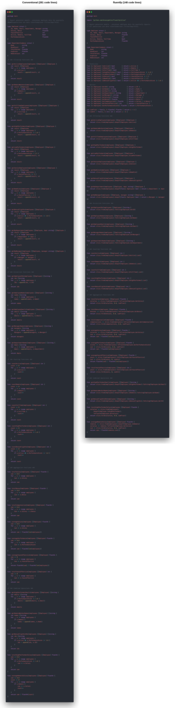
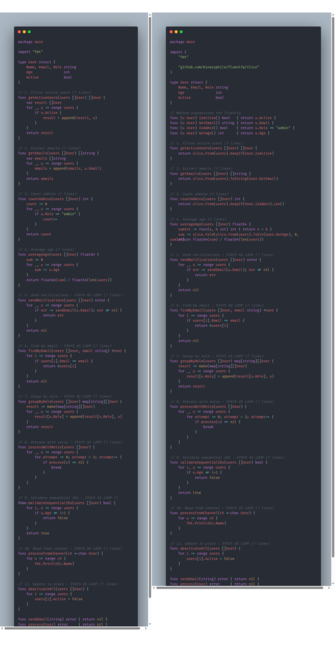

# Conventional vs fluentfp: Code Shape, Complexity, and Bug Surface

**Filter/map/fold rewrites drop branch-point complexity 95% and code 47% in pure data pipelines; 26% and 12% in typical Go modules where many loops aren't convertible.** Two pairs of files below show this with side-by-side visualizations, scc-measured numbers, and per-line attributions of the loop-mechanics bug classes the rewrite makes structurally absent.

The visual shape change is dramatic when every loop converts (best case, immediately below) and subtle when only a fraction does (typical case, further down). In the typical case the value is less about visible shape and more about the bugs that become unwritable and the branch points that disappear — both adjacent to code shape rather than strictly under it.

Indent levels track complexity closely: identical drop in the typical pair (−26% / −26%), close-but-not-identical in the pure pipeline (−80% indent / −95% complexity). The mismatch in the pipeline pair is because a multi-line chain can have visual indentation with zero branch points; in the typical pair, every removed indent comes with a removed branch point. Eyeball the shape, get the estimate. See [analysis.md § The Principle](../../analysis.md#the-principle) for the full argument.

---

## Pure data pipeline (best case)

A report generator with no I/O, only data transformations — the ceiling for fluentfp's impact.



| File | Code | Complexity |
|---|---:|---:|
| [best-case-conventional.go](best-case-conventional.go) | 281 | 57 |
| [best-case-fluentfp.go](best-case-fluentfp.go) | 148 | 3 |
| **Reduction** | **−47%** | **−95%** |

When every operation fits filter/map/fold, complexity drops from 57 to 3 — every `for` and `if` is gone; chains have no branch points to count. The remaining complexity-3 is three operators inside predicates (one `&&`, two `==`), not iteration or branching syntax. Because the conversion is total, there is no preserved-risk surface to enumerate — the bug-category catalog reduces to zero applicable rows.

---

## Mixed code (typical case)

Mirrors a typical production ratio: ~36% of operations are filter/map/fold-convertible; the rest stay as conventional loops with break/continue/error returns.



| File | Code | Complexity |
|---|---:|---:|
| [conventional.go](conventional.go) | 91 | 23 |
| [fluentfp.go](fluentfp.go) | 80 | 17 |
| **Reduction** | **−12%** | **−26%** |

The code-shape change is modest — 12% fewer lines, four converted functions out of eleven, a small stairstep flattened where each conversion sat. The complexity reduction is sharper (26%, branch points only in the convertible code path), and the bug-class elimination sharper still (next subsection). For typical Go modules — the realistic case — the value of fluentfp lives in correctness and branch-point reduction more than in visible shape. Complexity is scc's count of branch and loop tokens; see [methodology.md § F](../../methodology.md#f-code-metrics-tool-scc).

### Error surfaces reduced — and preserved

The first three converted functions (`getActiveUsers`, `getEmails`, `countAdmins`), and most of the fourth (`averageAge`), replace **accumulator bookkeeping**. Each conventional version declares a `result` slice or `count` int and feeds it inside a loop body. Two structural failure modes the pattern admits:

- Forgotten `result = ` on `append` — works until the backing array reallocates, then silently drops elements.
- `count++` placed outside the `if` — counts everything instead of the predicate match.

`KeepIf`, `ToString`, `Len`, and `Fold` create the accumulator internally; in these four call sites, those mistakes are no longer expressible. (`averageAge` carries the additional risks of divide-by-zero and integer overflow, which fluentfp does not address — both forms have those risks identically.)

The seven functions kept as loops (5–11) retain other risk surfaces. The lines below point into `conventional.go`:

| Function | Risk preserved | Why fluentfp doesn't replace it |
|---|---|---|
| `findByEmail` (line 64) | explicit `users[i]` indexing — index-arithmetic class | the function requires a pointer to the original element; chains return values |
| `processWithRetry` (line 83) | nested-loop `break` — premature-exit class | multi-level imperative control flow with success-dependent early exit |
| `validateSequentialIDs` (line 94) | `i+1` arithmetic — index-arithmetic class | possible via `seq.Enumerate` + `Every`, but reads less clearly than the loop |
| `deactivateAll` (line 111) | input slice mutation | the chain version (`slice.From(users).Transform(deactivate)`) returns a new slice; same elements-deactivated semantics, but the caller has to assign the result. Mostly a signature swap — the example keeps the mutation form to show what it looks like |

The examples therefore preserve both reduced and unreduced error surfaces. See [analysis.md § Error Prevention](../../analysis.md#error-prevention) for the broader category table (index typo, defer-in-loop, error shadowing, input mutation) the kept loops illustrate.

---

## Indent tracks complexity

Indentation correlates with complexity because both trace to the same source. Verified on these same files using `scc` for complexity and `awk` for tab-sum (per [analysis.md § Measuring the Correlation](../../analysis.md#measuring-the-correlation)):

| Pair | Indent change | Complexity change |
|---|---:|---:|
| Best-case | −80% | −95% |
| Mixed | −26% | −26% |

In the pure-pipeline pair complexity drops *more* than indent does (−95% vs −80%) — a multi-line chain can have visual indentation with zero branch points. In the mixed pair the two metrics drop identically (−26% / −26%) — here, indent is an effective 1:1 estimator. Indent is the conservative eyeball estimate.

---

## What to look for when reading the pairs

**Chain vs nested block.** A filter+map+extract in `fluentfp.go` is one expression on three lines, all at the same indent. The same task in `conventional.go` is a `var` declaration and a `for` header at the function indent, then a nested `if` one level deeper, then an `append` one level deeper still — three indents in four lines. The stairstep is the shape difference the visualizations expose.

**Where the loop stays.** `sendNotifications` in `fluentfp.go` keeps the imperative `for` body because it has an early return on error. fluentfp doesn't try to replace every loop, only the mechanical ones. See the "lower-yield code patterns" table in [analysis.md § Trade-offs](../../analysis.md#trade-offs).

**Method expressions.** `User.IsActive` and `User.GetEmail` plug directly into `KeepIf` and `ToString` — the receiver-as-first-arg shape matches the higher-order signature. No wrapper closures, no `func(u User) bool { return u.IsActive() }` adapters.

**Density.** The fluentfp files spend more lines per unit of intent on the chains (which carry meaning) and fewer on mechanics (variable declarations, loop headers, closing braces). In the mixed pair, fluentfp removes 11 lines while preserving the same behavior, primarily by eliminating those mechanical lines. [Methodology § B-C](../../methodology.md#b-line-classification-rules) defines the semantic-vs-syntactic line rules used to compute this.

---

## Reproducing the numbers

The files build with `//go:build ignore` — they don't compile as a package. Measure directly:

```bash
# Code + complexity per file (glob excludes this README)
scc --by-file examples/loop-to-chain/*.go

# Indent sum (tabs)
awk 'BEGIN{s=0} {n=0; while(substr($0,n+1,1)=="\t") n++; s+=n} END{print s}' \
  examples/loop-to-chain/conventional.go
```

scc reports the same code/complexity numbers shown in the tables above. The awk script gives per-file tab-sums; compute the percentage from any pair (e.g., (72−97)/97 = −26% for the mixed pair).

---

## See also

- [analysis.md](../../analysis.md) — full argument for code shape as a complexity proxy, plus categories of loop-mechanics bugs that fluentfp eliminates.
- [methodology.md](../../methodology.md) — measurement rules: line classification, scc usage, chain formatting conventions.
- [docs/showcase.md](../../docs/showcase.md) — 24 before/after rewrites of real-world code from public Go projects.
