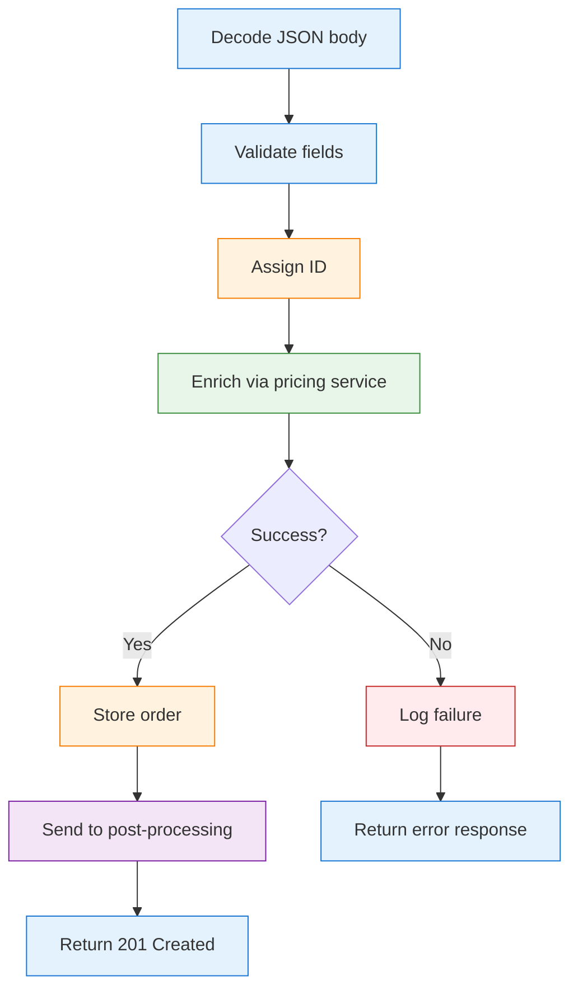

# Conventional Go vs fluentfp -- Complete Side by Side

This document shows every place the orders example uses fluentfp, paired with the conventional Go equivalent. Read the [README](README.md) first for the narrative walkthrough.

## Request Lifecycle



| Step | Conventional Go | fluentfp | What changes |
|------|----------------|----------|--------------|
| **Decode** | Content-Type check + MaxBytesReader + DisallowUnknownFields + Decode + error response (15 lines) | `web.DecodeJSON[Order](req)` (1 line) | All decoding policy in one call |
| **Validate** | Monolithic `validateOrder()` returning bare `error` + error response block (15 lines) | `.FlatMap(Order.Validate)` -- method expression (1 line) | Validation logic on the type, used as a plain function |
| **Assign ID** | `order.ID = ...; order.Status = ...` mutating in place (2 lines) | `.Transform(withNewID)` -- pure transform on Ok value (1 line) | Mutation wrapped in named function |
| **Enrich** | `breaker.allow()` check + call + `recordSuccess`/`recordFailure` + error response (12 lines, plus 40+ line breaker impl) | `.FlatMap(enrich)` in the chain (1 line) | Breaker is a decorator -- invisible to caller |
| **Log failure** | `log.Printf` inside `if err != nil` branch (1 line, tangled with response writing) | `.TapErr(logFailure)` -- error-side side effect in pipeline (1 line) | Logging separated from response rendering |
| **Store + notify** | `store.put` + `log` + channel send (6 lines) | `.Tap(storeAndNotify)` -- side effects in named function (1 line) | Side effects named and composable |
| **Respond** | `w.Header().Set` + `WriteHeader` + `Encode` (3 lines, repeated 6×) | `rslt.Map(storedResult, web.Created[Order])` (1 line) | `Adapt` renders once |
| **Error -> HTTP** | `if errors.Is(err, ...)` + response block, repeated per handler | `web.WithErrorMapper(mapDomainError)` defined once at boundary | One mapping function for all handlers |

## The Complete POST Handler

The conventional version on the left is what you'd write with the standard library. The fluentfp version on the right has the same behavior. Each section below shows the same step side by side.

### Signature

<table>
<tr><th>Conventional</th><th>fluentfp</th></tr>
<tr>
<td>

```go
func handleCreateOrder(
  w http.ResponseWriter,
  req *http.Request,
) {
```

Mutates `ResponseWriter`.

</td>
<td>

```go
handleCreateOrder := func(
  req *http.Request,
) rslt.Result[web.Response] {
```

Returns a value. `web.Adapt` renders it.

</td>
</tr>
</table>

### Decode

<table>
<tr><th>Conventional</th><th>fluentfp</th></tr>
<tr>
<td>

```go
ct := req.Header.Get("Content-Type")
if ct != "application/json" {
  w.Header().Set("Content-Type",
    "application/json")
  w.WriteHeader(415)
  json.NewEncoder(w).Encode(
    map[string]string{
      "error": "expected application/json",
    })
  return
}
var order Order
dec := json.NewDecoder(
  http.MaxBytesReader(w, req.Body, 1<<20))
dec.DisallowUnknownFields()
if err := dec.Decode(&order); err != nil {
  w.Header().Set("Content-Type",
    "application/json")
  w.WriteHeader(400)
  json.NewEncoder(w).Encode(
    map[string]string{
      "error": err.Error(),
    })
  return
}
```

</td>
<td>

```go
// One call: content-type, size limit,
// unknown fields, JSON decode.
orderResult := web.DecodeJSON[Order](req)
```

Returns `Result[Order]` -- Ok or Err with the right HTTP status.

</td>
</tr>
</table>

### Validate

<table>
<tr><th>Conventional</th><th>fluentfp</th></tr>
<tr>
<td>

```go
if order.Customer == "" {
  w.Header().Set("Content-Type",
    "application/json")
  w.WriteHeader(400)
  json.NewEncoder(w).Encode(
    map[string]string{
      "error": "customer is required",
    })
  return
}
if len(order.Items) == 0 {
  // ... same 7-line block ...
}
```

Each check repeats the response block.

</td>
<td>

```go
// FlatMap: if decode failed, skip.
// If validation fails, rest is skipped.
storedResult := orderResult.
  FlatMap(Order.Validate). ...
```

`Order.Validate` is a method expression -- Go turns the method into `func(Order) Result[Order]`, which is what FlatMap needs.

</td>
</tr>
</table>

### Assign ID

<table>
<tr><th>Conventional</th><th>fluentfp</th></tr>
<tr>
<td>

```go
order.ID = fmt.Sprintf(
  "ord-%d", idCounter.Add(1))
order.Status = "pending"
```

Mutates `order` in place.

</td>
<td>

```go
  ... .Transform(withNewID). ...
```

`withNewID` returns a new Order with ID set. `Transform` applies `func(T) T` to the Ok value.

</td>
</tr>
</table>

### Enrich (circuit breaker)

<table>
<tr><th>Conventional</th><th>fluentfp</th></tr>
<tr>
<td>

```go
if !breaker.allow() {
  w.Header().Set("Content-Type",
    "application/json")
  w.WriteHeader(503)
  json.NewEncoder(w).Encode(
    map[string]string{
      "error": "pricing unavailable",
    })
  return
}
enriched, err := enrichOrder(
  req.Context(), order)
if err != nil {
  breaker.recordFailure()
  log.Printf(
    "enrichment failed: %v", err)
  // ... 7-line error response ...
  return
}
breaker.recordSuccess()
```

Breaker check + call + record + error response tangled.

</td>
<td>

```go
  ... .FlatMap(enrich). ...
```

`enrich = rslt.LiftCtx(ctx, enrichWithBreaker)` -- binds context, wraps `(T, error)` -> `Result[T]`. Breaker is invisible to the pipeline.

</td>
</tr>
</table>

### Error logging + Store + Respond

<table>
<tr><th>Conventional</th><th>fluentfp</th></tr>
<tr>
<td>

```go
store.put(enriched)
log.Printf(
  "created order %s", enriched.ID)
select {
case postCh <- enriched:
default:
  log.Printf("channel full, skipping")
}
w.Header().Set("Content-Type",
  "application/json")
w.WriteHeader(201)
json.NewEncoder(w).Encode(enriched)
```

</td>
<td>

```go
  ... .TapErr(logFailure).  // log err
      .Tap(storeAndNotify)  // persist
return rslt.Map(
  stored, web.Created[Order]) // 201
```

`TapErr`: side effect on error. `Tap`: side effect on success. `rslt.Map`: wrap Ok in 201 response.

</td>
</tr>
</table>

### What the pipeline eliminates

| Conventional | fluentfp | Why |
|---|---|---|
| 6× `Set`/`WriteHeader`/`Encode` | Zero | `Adapt` renders once |
| Content-Type + MaxBytesReader + DisallowUnknownFields | `DecodeJSON` | One call |
| Separate decode/validate error blocks | `FlatMap` | Chains; errors propagate |
| `allow`/`recordSuccess`/`recordFailure` | `WithBreaker` | Decorator |
| `errors.Is` in handler | `WithErrorMapper` | At boundary |
| `log.Printf` in error branches | `TapErr` | Pipeline side effect |

The conventional version also excludes the 40+ lines to implement `circuitBreaker` itself.

---

## Beyond the POST Handler

The POST handler is covered section-by-section above. The remaining comparisons cover the GET handler, list handler, middleware, and background pipeline.


### Resource Lookup (GET Handler)

<table>
<tr><th>Conventional</th><th>fluentfp</th></tr>
<tr>
<td>

```go
order, ok := s.get(id)
if !ok {
  w.Header().Set("Content-Type",
    "application/json")
  w.WriteHeader(404)
  json.NewEncoder(w).Encode(
    map[string]string{
      "error": "order not found",
      "code":  "NOT_FOUND"})
  return
}
w.Header().Set("Content-Type",
  "application/json")
w.WriteHeader(200)
json.NewEncoder(w).Encode(order)
```

Two branches, identical boilerplate.

</td>
<td>

```go
// PathParam: get path variable as Option.
// OkOr: missing param -> Err(400).
idResult := web.PathParam(req, "id").
  OkOr(web.BadRequest("missing order id"))

// FlatMap: findOrder can fail (404),
// so it returns Result -- use FlatMap.
foundResult := rslt.FlatMap(idResult, findOrder)

// Map: web.OK always succeeds (just wraps
// in 200), so it returns a plain value --
// use Map, not FlatMap.
return rslt.Map(foundResult, web.OK[Order])
```

The difference between `FlatMap` and `Map`: if the next function can fail (returns `Result`), use `FlatMap`. If it always succeeds (returns a plain value), use `Map`. Both are standalone here because the types change (string -> Order -> Response) -- Go methods can't change the generic type parameter.

</td>
</tr>
</table>

### Map Lookup

The pricing function uses `prices[item.SKU]` directly -- SKU validation already ran in the validation chain, so every SKU here is known-good. No error check needed.

`option.Lookup` earns its keep when you need a fallback: `option.Lookup(m, k).Or(default)` replaces the entire `if !ok` block in one expression.

### Query Parameter Parsing

<table>
<tr><th>Conventional</th><th>fluentfp</th></tr>
<tr>
<td>

```go
status := q.Get("status")
hasStatus := status != ""

var mt int
var hasMinTotal bool
if raw := q.Get("min_total"); raw != "" {
  parsed, err := strconv.Atoi(raw)
  if err != nil {
    w.Header().Set("Content-Type",
      "application/json")
    w.WriteHeader(400)
    json.NewEncoder(w).Encode(
      map[string]string{
        "error": fmt.Sprintf(
          "min_total must be int, got %q",
          raw)})
    return
  }
  mt = parsed
  hasMinTotal = true
}
```

Mutable variables declared before the conditional, assigned inside it.

</td>
<td>

```go
// NonEmpty: "" -> not-ok, non-empty -> ok.
// Get: unpack to (value, bool).
status, hasStatus := option.NonEmpty(q.Get("status")).Get()
rawMinTotalOption := option.NonEmpty(q.Get("min_total"))
// FlatMapResult: missing -> skip,
// valid int -> use it, bad input -> 400.
minTotalResult := option.FlatMapResult(
  rawMinTotalOption, parseMinTotal)
// Unpack: convert Result back to Go's (value, error).
mtOption, err := minTotalResult.Unpack()
mt, hasMinTotal := mtOption.Get()
```

`FlatMapResult` handles the three cases for an optional parseable parameter: missing (skip), valid integer (use it), invalid input (400 error). No mutable `var` declarations.

</td>
</tr>
</table>

### Conditional List Filtering

<table>
<tr><th>Conventional</th><th>fluentfp</th></tr>
<tr>
<td>

```go
orders := s.list()
sort.Slice(orders, func(i, j int) bool {
  return orders[i].ID < orders[j].ID
})

if hasStatus {
  var filtered []Order
  for _, o := range orders {
    if o.Status == status {
      filtered = append(filtered, o)
    }
  }
  orders = filtered
}

if hasMinTotal {
  var filtered []Order
  for _, o := range orders {
    if o.TotalCents >= mt {
      filtered = append(filtered, o)
    }
  }
  orders = filtered
}
```

25 lines. Sort key buried in closure. Filter pattern repeated identically.

</td>
<td>

```go
orders := slice.SortBy(s.list(), orderNum)
if hasStatus {
  orders = orders.KeepIf(hasMatchingStatus)
}
if hasMinTotal {
  orders = orders.KeepIf(totalAtLeast)
}
```

`SortBy` takes a key function -- `orderNum` extracts the numeric suffix for correct ordering. `KeepIf` with named predicates replaces the `for`/`append` loop. The `if` guards are plain Go -- no special API needed for conditional filtering outside a chain.

</td>
</tr>
</table>

### Context Values

<table>
<tr><th>Conventional</th><th>fluentfp</th></tr>
<tr>
<td>

```go
type contextKey struct{}
var requestIDKey = contextKey{}

ctx := context.WithValue(
  r.Context(), requestIDKey, "req-1")

reqID, ok := req.Context().
  Value(requestIDKey).(string)
if !ok {
  reqID = "unknown"
}
```

Sentinel key type + type assertion + nil check.

</td>
<td>

```go
// With stores a value keyed by its Go type.
ctx := ctxval.With(r.Context(), RequestID("req-1"))

// From retrieves by type -> Option. Or provides fallback.
reqID := ctxval.Get[RequestID](req.Context()).Or("unknown")
```

The Go type itself is the key -- no sentinel type to define. `From` returns an `Option`, so `.Or("unknown")` handles the absent case.

</td>
</tr>
</table>

### Background Pipeline

<table>
<tr><th>Conventional</th><th>fluentfp</th></tr>
<tr>
<td>

```go
orderCh := make(chan Order, 10)
auditCh := make(chan Order, 10)
inventoryCh := make(chan Order, 10)

go func() {
  for o := range orderCh {
    auditCh <- o
    inventoryCh <- o
  }
  close(auditCh)
  close(inventoryCh)
}()

go func() {
  for o := range auditCh {
    log.Printf("audit: %s", o.ID)
  }
}()

go func() {
  for o := range inventoryCh {
    log.Printf("inv: %d", len(o.Items))
  }
}()
```

3 channels, 3 goroutines, manual close ordering. No backpressure, no metrics, no error propagation.

</td>
<td>

```go
// FromChan: plain chan Order -> chan Result[Order] for toc.
// NewTee: broadcast each item to 2 branches.
tee := toc.NewTee(ctx, toc.FromChan(postCh), 2)
// Pipe: chain a processing function onto a branch.
auditPipe := toc.Pipe(
  ctx, tee.Branch(0), logOrder, toc.Options[Order]{})
inventoryPipe := toc.Pipe(
  ctx, tee.Branch(1), countItems, toc.Options[Order]{})
```

`toc.FromChan` bridges `chan Order` -> `chan rslt.Result[Order]` -- no passthrough stage needed. Backpressure, cancellation, shutdown ordering, and `Stats()` built in.

</td>
</tr>
</table>
