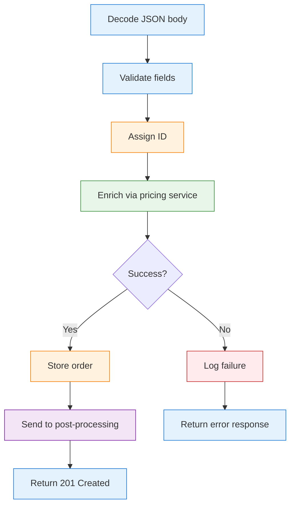

# Conventional Go vs fluentfp — Complete Side by Side

This document shows every place the orders example uses fluentfp, paired with the conventional Go equivalent. Read the [README](README.md) first for the narrative walkthrough.

## Request Lifecycle



| Step | Conventional Go | fluentfp | What changes |
|------|----------------|----------|--------------|
| **Decode** | Content-Type check + MaxBytesReader + DisallowUnknownFields + Decode + error response (15 lines) | `web.DecodeJSON[Order](req)` (1 line) | All decoding policy in one call |
| **Validate** | Monolithic `validateOrder()` returning bare `error` + error response block (15 lines) | `.FlatMap(validateOrder)` where `validateOrder = web.Steps(...)` (1 line) | Composable list of named validators, each carrying its HTTP status |
| **Assign ID** | `order.ID = ...; order.Status = ...` mutating in place (2 lines) | `.Transform(withNewID)` — pure transform on Ok value (1 line) | Mutation wrapped in named function |
| **Enrich** | `breaker.allow()` check + call + `recordSuccess`/`recordFailure` + error response (12 lines, plus 40+ line breaker impl) | `.FlatMap(enrich)` in the chain (1 line) | Breaker is a decorator — invisible to caller |
| **Log failure** | `log.Printf` inside `if err != nil` branch (1 line, tangled with response writing) | `.TapErr(logFailure)` — error-side side effect in pipeline (1 line) | Logging separated from response rendering |
| **Store + notify** | `store.put` + `log` + channel send (6 lines) | `.Tap(storeAndNotify)` — side effects in named function (1 line) | Side effects named and composable |
| **Respond** | `w.Header().Set` + `WriteHeader` + `Encode` (3 lines, repeated 6×) | `rslt.Map(stored, web.Created[Order])` (1 line) | `Adapt` renders once |
| **Error → HTTP** | `if errors.Is(err, ...)` + response block, repeated per handler | `web.WithErrorMapper(mapDomainError)` defined once at boundary | One mapping function for all handlers |

## The Complete POST Handler

The conventional version on the left is what you'd write with the standard library. The fluentfp version on the right has the same behavior. Look at the *shape* — the left is a tree of `if` branches, the right is a linear pipeline.

<table>
<tr>
<th>Conventional Go</th>
<th>fluentfp</th>
</tr>
<tr>
<td>

```go
func handleCreateOrder(w http.ResponseWriter, req *http.Request) {
  // --- decode ---
  if req.Header.Get("Content-Type") != "application/json" {
    w.Header().Set("Content-Type", "application/json")
    w.WriteHeader(415)
    json.NewEncoder(w).Encode(map[string]string{
      "error": "expected application/json"})
    return
  }
  var order Order
  dec := json.NewDecoder(
    http.MaxBytesReader(w, req.Body, 1<<20))
  dec.DisallowUnknownFields()
  if err := dec.Decode(&order); err != nil {
    w.Header().Set("Content-Type", "application/json")
    w.WriteHeader(400)
    json.NewEncoder(w).Encode(map[string]string{
      "error": err.Error()})
    return
  }

  // --- validate ---
  if order.Customer == "" {
    w.Header().Set("Content-Type", "application/json")
    w.WriteHeader(400)
    json.NewEncoder(w).Encode(map[string]string{
      "error": "customer is required"})
    return
  }
  if len(order.Items) == 0 {
    w.Header().Set("Content-Type", "application/json")
    w.WriteHeader(400)
    json.NewEncoder(w).Encode(map[string]string{
      "error": "must have items"})
    return
  }

  // --- assign ID ---
  order.ID = fmt.Sprintf("ord-%d", idCounter.Add(1))
  order.Status = "pending"

  // --- enrich (with breaker) ---
  if !breaker.allow() {
    w.Header().Set("Content-Type", "application/json")
    w.WriteHeader(503)
    json.NewEncoder(w).Encode(map[string]string{
      "error": "pricing unavailable"})
    return
  }
  enriched, err := enrichOrder(req.Context(), order)
  if err != nil {
    breaker.recordFailure()
    log.Printf("enrichment failed: %v", err)
    w.Header().Set("Content-Type", "application/json")
    w.WriteHeader(500)
    json.NewEncoder(w).Encode(map[string]string{
      "error": "internal error"})
    return
  }
  breaker.recordSuccess()

  // --- store + respond ---
  store.put(enriched)
  log.Printf("created order %s", enriched.ID)
  select {
  case postCh <- enriched:
  default:
    log.Printf("channel full, skipping")
  }
  w.Header().Set("Content-Type", "application/json")
  w.WriteHeader(201)
  json.NewEncoder(w).Encode(enriched)
}
```

</td>
<td>

```go
handleCreateOrder := func(req *http.Request) rslt.Result[web.Response] {
  reqID := ctxval.From[RequestID](req.Context()).Or("unknown")

  // --- named operations ---

  withNewID := func(o Order) Order {
    o.ID = fmt.Sprintf("ord-%d", idCounter.Add(1))
    o.Status = "pending"
    return o
  }

  enrich := rslt.LiftCtx(req.Context(), enrichWithBreaker)

  logFailure := func(err error) {
    log.Printf("[%s] enrichment failed: %v", reqID, err)
  }

  storeAndNotify := func(o Order) {
    s.put(o)
    log.Printf("[%s] created order %s", reqID, o.ID)
    select {
    case postCh <- o:
    default:
      log.Printf("[%s] channel full", reqID)
    }
  }

  // --- pipeline ---

  order := web.DecodeJSON[Order](req)
  stored := order.
    FlatMap(validateOrder).
    Transform(withNewID).
    FlatMap(enrich).
    TapErr(logFailure).
    Tap(storeAndNotify)
  return rslt.Map(stored, web.Created[Order])
}
```

</td>
</tr>
</table>

The left side is a tree: six `if` branches, each ending in 3-4 lines of response-writing, then `return`. The right side is a line: each step feeds the next, and errors propagate automatically. The named operations (top half) define *what* each step does; the pipeline (bottom half) defines *when*.

What the pipeline eliminates:

| Conventional | fluentfp | Why it's gone |
|---|---|---|
| 6× `w.Header().Set` / `WriteHeader` / `Encode` blocks | Zero | `web.Adapt` renders all responses once |
| Content-Type check + MaxBytesReader + DisallowUnknownFields | `web.DecodeJSON` | One call does all three |
| Separate decode and validate error blocks | `rslt.FlatMap` | Chains them; errors propagate |
| `breaker.allow()` / `recordSuccess()` / `recordFailure()` | `enrichWithBreaker` | Decorator — same signature, breaker invisible |
| `if errors.Is(err, errCircuitOpen)` in handler | `web.WithErrorMapper` | Defined once at adapter boundary |
| `log.Printf` on error scattered in branches | `TapErr(logFailure)` | Error-side side effect in the pipeline |

The conventional version also excludes the 40+ lines needed to implement `circuitBreaker` itself.

---

## Each Piece, Individually

### Request Decoding

<table>
<tr><th>Conventional</th><th>fluentfp</th></tr>
<tr>
<td>

```go
if req.Header.Get("Content-Type") !=
    "application/json" {
  w.Header().Set("Content-Type",
    "application/json")
  w.WriteHeader(415)
  json.NewEncoder(w).Encode(
    map[string]string{
      "error": "expected application/json"})
  return
}
var order Order
dec := json.NewDecoder(
  http.MaxBytesReader(w, req.Body, 1<<20))
dec.DisallowUnknownFields()
if err := dec.Decode(&order); err != nil {
  w.Header().Set("Content-Type",
    "application/json")
  w.WriteHeader(400)
  json.NewEncoder(w).Encode(
    map[string]string{"error": err.Error()})
  return
}
```

</td>
<td>

```go
order := web.DecodeJSON[Order](req)
```

Returns `Result[Order]` — the decoded order or a structured error (415, 413, 400). Content-type, body size limit, unknown fields — all handled.

</td>
</tr>
</table>

### Validation

<table>
<tr><th>Conventional</th><th>fluentfp</th></tr>
<tr>
<td>

```go
func validateOrder(o Order) error {
  if o.Customer == "" {
    return fmt.Errorf("customer is required")
  }
  if len(o.Items) == 0 {
    return fmt.Errorf("must have items")
  }
  for _, item := range o.Items {
    if item.Quantity <= 0 {
      return fmt.Errorf("positive qty required")
    }
  }
  return nil
}
```

One monolithic function. Bare `error` loses the HTTP status code.

</td>
<td>

```go
validateOrder := web.Steps(hasCustomer, hasItems, itemsHavePositiveQty)
```

A list of named functions. Each carries its own status code:

```go
func itemsHavePositiveQty(o Order) rslt.Result[Order] {
  if !slice.From(o.Items).Every(LineItem.HasPositiveQty) {
    return rslt.Err[Order](web.BadRequest("positive qty required"))
  }
  return rslt.Ok(o)
}
```

Adding a validation = adding a name to the list.

</td>
</tr>
</table>

### Chaining Decode → Validate → Transform

This is where `FlatMap` and `Transform` replace `if err != nil` blocks.

<table>
<tr><th>Conventional</th><th>fluentfp</th></tr>
<tr>
<td>

```go
// decode
if err := dec.Decode(&order); err != nil {
  // write 400...
  return
}
// validate
if err := validateOrder(order); err != nil {
  // write 400...
  return
}
// assign
order.ID = fmt.Sprintf("ord-%d",
  idCounter.Add(1))
order.Status = "pending"
```

Three blocks. Each fallible step needs its own error check and response. The assignment mutates `order` in place.

</td>
<td>

```go
order := web.DecodeJSON[Order](req)
assigned := order.
  FlatMap(validateOrder).
  Transform(withNewID)
```

A chain. `FlatMap` passes the Ok value to `validateOrder`; if it returns Err, the chain stops. `Transform` applies `withNewID` to the Ok value. Each method returns a `Result`, so the chain continues.

`FlatMap` is called "flat" because `validateOrder` returns `Result[Order]`: a plain `Map` would nest that into `Result[Result[Order]]`. FlatMap keeps it one level deep.

</td>
</tr>
</table>

### Circuit Breaker

<table>
<tr><th>Conventional</th><th>fluentfp</th></tr>
<tr>
<td>

```go
// 40+ lines of breaker implementation:
type circuitBreaker struct {
  mu       sync.Mutex
  failures int
  state    int // 0=closed, 1=open, 2=half-open
  openedAt time.Time
  // ...
}
func (cb *circuitBreaker) allow() bool { ... }
func (cb *circuitBreaker) recordSuccess() { ... }
func (cb *circuitBreaker) recordFailure() { ... }

// In handler (12 lines):
if !breaker.allow() {
  w.Header().Set("Content-Type",
    "application/json")
  w.WriteHeader(503)
  json.NewEncoder(w).Encode(
    map[string]string{
      "error": "pricing unavailable"})
  return
}
enriched, err := enrichOrder(
  req.Context(), order)
if err != nil {
  breaker.recordFailure()
  // write 500 response...
} else {
  breaker.recordSuccess()
}
```

Three concerns tangled: state checking, result recording, response writing. The hand-rolled breaker also has a bug (half-open rejects all requests).

</td>
<td>

```go
// Setup (5 lines, once):
breaker := call.NewBreaker(call.BreakerConfig{
  ResetTimeout: 10 * time.Second,
  ReadyToTrip:  call.ConsecutiveFailures(3),
})
enrichWithBreaker := call.WithBreaker(breaker, enrichOrder)

// In handler:
enrich := rslt.LiftCtx(req.Context(), enrichWithBreaker)

// In the chain:
.FlatMap(enrich)
```

Same signature as `enrichOrder`. The handler doesn't know a breaker exists. Probe gating, panic recovery, cancellation handled.

</td>
</tr>
</table>

### Error Logging + Error Mapping

<table>
<tr><th>Conventional</th><th>fluentfp</th></tr>
<tr>
<td>

```go
// In handler — logging + error mapping tangled:
enriched, err := enrichOrder(
  req.Context(), order)
if err != nil {
  log.Printf("enrichment failed: %v", err)
  if errors.Is(err, errCircuitOpen) {
    w.Header().Set("Content-Type",
      "application/json")
    w.WriteHeader(503)
    json.NewEncoder(w).Encode(
      map[string]string{
        "error": "pricing unavailable"})
    return
  }
  w.Header().Set("Content-Type",
    "application/json")
  w.WriteHeader(500)
  json.NewEncoder(w).Encode(
    map[string]string{
      "error": "internal error"})
  return
}
```

Logging, error classification, and response rendering — all in one `if err` block. Repeated per handler.

</td>
<td>

```go
// Error logging (in the chain):
logFailure := func(err error) {
  log.Printf("[%s] enrichment failed: %v", reqID, err)
}
// ... chain includes: .TapErr(logFailure).Tap(storeAndNotify)

// Error mapping (defined once, at boundary):
func mapDomainError(err error) (*web.Error, bool) {
  if errors.Is(err, call.ErrCircuitOpen) {
    return &web.Error{Status: 503, Message: "unavailable"}, true
  }
  if errors.Is(err, errPricingFailure) {
    return &web.Error{Status: 502, Message: "pricing error"}, true
  }
  return nil, false
  // Unknown SKUs are caught in validation (400),
  // so they never reach the breaker.
}
web.Adapt(handler, web.WithErrorMapper(
  mapDomainError))
```

Three concerns, three locations: `TapErr` logs in the pipeline (side effect, error unchanged), `WithErrorMapper` classifies at the boundary, `Adapt` renders.

</td>
</tr>
</table>

### Resource Lookup (GET Handler)

<table>
<tr><th>Conventional</th><th>fluentfp</th></tr>
<tr>
<td>

```go
order, ok := s.get(id)
if !ok {
  w.Header().Set("Content-Type",
    "application/json")
  w.WriteHeader(404)
  json.NewEncoder(w).Encode(
    map[string]string{
      "error": "order not found",
      "code":  "NOT_FOUND"})
  return
}
w.Header().Set("Content-Type",
  "application/json")
w.WriteHeader(200)
json.NewEncoder(w).Encode(order)
```

Two branches, identical boilerplate.

</td>
<td>

```go
id := web.PathParam(req, "id").OkOr(web.BadRequest("missing order id"))
found := rslt.FlatMap(id, findOrder)
return rslt.Map(found, web.OK[Order])
```

`web.PathParam` wraps `PathValue` + `NonEmpty` into `Option[string]`. `.OkOr` bridges to `Result[string]`. `rslt.FlatMap` calls `findOrder` (which uses `option.New` + `.OkOr` to bridge the store lookup). `rslt.Map` wraps Ok in a 200 response. Errors propagate untouched.

</td>
</tr>
</table>

### Map Lookup

The pricing function uses `prices[item.SKU]` directly — SKU validation already ran in the validation chain, so every SKU here is known-good. No error check needed.

`option.Lookup` earns its keep when you need a fallback: `option.Lookup(m, k).Or(default)` replaces the entire `if !ok` block in one expression.

### Query Parameter Parsing

<table>
<tr><th>Conventional</th><th>fluentfp</th></tr>
<tr>
<td>

```go
status := q.Get("status")
hasStatus := status != ""

var mt int
var hasMinTotal bool
if raw := q.Get("min_total"); raw != "" {
  parsed, err := strconv.Atoi(raw)
  if err != nil {
    w.Header().Set("Content-Type",
      "application/json")
    w.WriteHeader(400)
    json.NewEncoder(w).Encode(
      map[string]string{
        "error": fmt.Sprintf(
          "min_total must be int, got %q",
          raw)})
    return
  }
  mt = parsed
  hasMinTotal = true
}
```

Mutable variables declared before the conditional, assigned inside it.

</td>
<td>

```go
status, hasStatus := option.NonEmpty(q.Get("status")).Get()
rawMinTotal := option.NonEmpty(q.Get("min_total"))
minTotalResult := option.FlatMapResult(rawMinTotal, parseMinTotal)
// err → 400 if present but invalid
mtOption, err := minTotalResult.Unpack()
mt, hasMinTotal := mtOption.Get()
```

`FlatMapResult` bridges optional and fallible: absent → `Ok(NotOk)`, present+valid → `Ok(Of(n))`, present+invalid → `Err(400)`. No mutable `var` declarations. Absent vs invalid is cleanly distinguished.

</td>
</tr>
</table>

### Conditional List Filtering

<table>
<tr><th>Conventional</th><th>fluentfp</th></tr>
<tr>
<td>

```go
orders := s.list()
sort.Slice(orders, func(i, j int) bool {
  return orders[i].ID < orders[j].ID
})

if hasStatus {
  var filtered []Order
  for _, o := range orders {
    if o.Status == status {
      filtered = append(filtered, o)
    }
  }
  orders = filtered
}

if hasMinTotal {
  var filtered []Order
  for _, o := range orders {
    if o.TotalCents >= mt {
      filtered = append(filtered, o)
    }
  }
  orders = filtered
}
```

25 lines. Sort key buried in closure. Filter pattern repeated identically.

</td>
<td>

```go
orders := slice.SortBy(s.list(), orderNum)
if hasStatus {
  orders = orders.KeepIf(hasMatchingStatus)
}
if hasMinTotal {
  orders = orders.KeepIf(totalAtLeast)
}
```

`SortBy` takes a key function — `orderNum` extracts the numeric suffix for correct ordering. `KeepIf` with named predicates replaces the `for`/`append` loop. The `if` guards are plain Go — no special API needed for conditional filtering outside a chain.

</td>
</tr>
</table>

### Context Values

<table>
<tr><th>Conventional</th><th>fluentfp</th></tr>
<tr>
<td>

```go
type contextKey struct{}
var requestIDKey = contextKey{}

ctx := context.WithValue(
  r.Context(), requestIDKey, "req-1")

reqID, ok := req.Context().
  Value(requestIDKey).(string)
if !ok {
  reqID = "unknown"
}
```

Sentinel key type + type assertion + nil check.

</td>
<td>

```go
ctx := ctxval.With(r.Context(), RequestID("req-1"))

reqID := ctxval.From[RequestID](req.Context()).Or("unknown")
```

Go type is the key. `Option` fallback.

</td>
</tr>
</table>

### Response Construction

<table>
<tr><th>Conventional (each response)</th><th>fluentfp (each response)</th></tr>
<tr>
<td>

```go
w.Header().Set("Content-Type",
  "application/json")
w.WriteHeader(http.StatusCreated)
json.NewEncoder(w).Encode(enriched)
```

3 lines of mutation, repeated per code path. Miss `Content-Type` → `text/plain`. `WriteHeader` after `Write` → silently ignored.

</td>
<td>

```go
return rslt.Map(stored, web.Created[Order])
```

1 expression. Status + body travel as data. `Adapt` renders once.

</td>
</tr>
</table>

### Background Pipeline

<table>
<tr><th>Conventional</th><th>fluentfp</th></tr>
<tr>
<td>

```go
orderCh := make(chan Order, 10)
auditCh := make(chan Order, 10)
inventoryCh := make(chan Order, 10)

go func() {
  for o := range orderCh {
    auditCh <- o
    inventoryCh <- o
  }
  close(auditCh)
  close(inventoryCh)
}()

go func() {
  for o := range auditCh {
    log.Printf("audit: %s", o.ID)
  }
}()

go func() {
  for o := range inventoryCh {
    log.Printf("inv: %d", len(o.Items))
  }
}()
```

3 channels, 3 goroutines, manual close ordering. No backpressure, no metrics, no error propagation.

</td>
<td>

```go
// Bridge plain channel, broadcast to 2 branches
tee := toc.NewTee(ctx, toc.FromChan(postCh), 2)
// Branch 0: audit log
auditPipe := toc.Pipe(
  ctx, tee.Branch(0), logOrder, toc.Options[Order]{})
// Branch 1: inventory count
inventoryPipe := toc.Pipe(
  ctx, tee.Branch(1), countItems, toc.Options[Order]{})
```

`toc.FromChan` bridges `chan Order` → `chan rslt.Result[Order]` — no passthrough stage needed. Backpressure, cancellation, shutdown ordering, and `Stats()` built in.

</td>
</tr>
</table>
