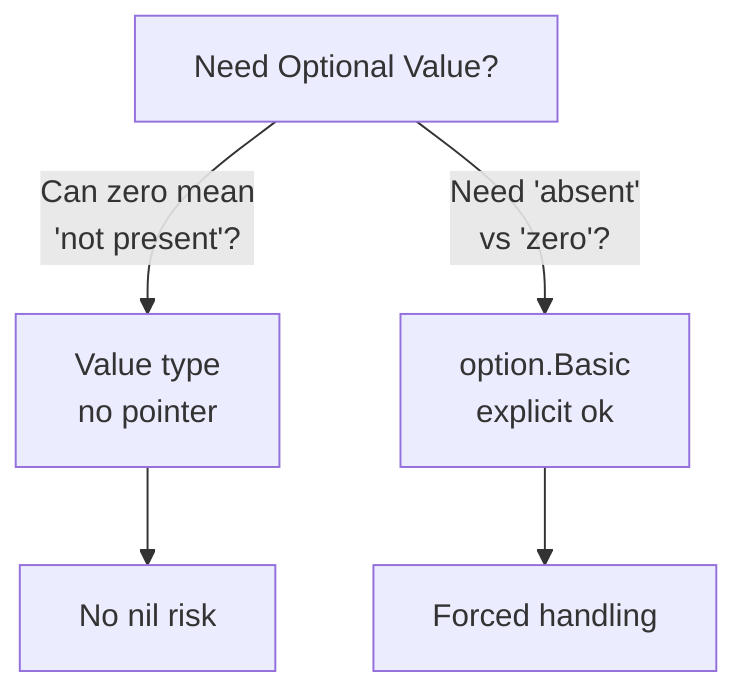

# The Billion-Dollar Mistake: Nil Safety in Go

In 2009, Tony Hoare—recipient of the 1980 Turing Award for his contributions to programming languages—gave a talk at QCon titled "Null References: The Billion Dollar Mistake." His confession:

> I call it my billion-dollar mistake. It was the invention of the null reference in 1965. At that time, I was designing the first comprehensive type system for references in an object oriented language (ALGOL W). My goal was to ensure that all use of references should be absolutely safe, with checking performed automatically by the compiler. But I couldn't resist the temptation to put in a null reference, simply because it was so easy to implement. This has led to innumerable errors, vulnerabilities, and system crashes, which have probably caused a billion dollars of pain and damage in the last forty years.
>
> — Tony Hoare, QCon 2009 ([InfoQ](https://www.infoq.com/presentations/Null-References-The-Billion-Dollar-Mistake-Tony-Hoare/))

The phrase "simply because it was so easy to implement" is telling. A colleague who worked with Hoare described his approach: "Tony has an amazing intuition for seeking a simple and elegant way of attacking problems" (Bill Roscoe, [FACS FACTS 2024](https://www.bcs.org/media/1wrosrpv/facs-jul24.pdf)). This intuition produced Quicksort, Hoare logic, and CSP. But with null references, simplicity backfired—the easy implementation created forty years of crashes.

Hoare's friend Edsger Dijkstra saw the problem early: "If you have a null reference, then every bachelor who you represent in your object structure will seem to be married polyamorously to the same person Null." The type system lies—it claims a reference points to a User, but it might point to nothing.

## Go's Nil Problem

Go inherited this mistake as `nil`. Pointers serve as "pseudo-options" where `nil` means "not present":

```go
// Conventional: pointer as pseudo-option
func FindUser(id string) *User {
    // returns nil if not found
}

// Caller must remember to check
user := FindUser("123")
if user != nil {          // Easy to forget
    fmt.Println(user.Name) // Panic if nil
}
```

The compiler doesn't enforce the nil check. Every pointer dereference is a potential panic waiting for the right input.

## Two Defenses

fluentfp addresses nil through two complementary strategies:

**1. Value Semantics (First Line of Defense)**

Avoid pointers where possible. No pointer means no nil:

```go
// Value type: no nil possible
type User struct {
    Name  string
    Email string
}

func GetUser() User {
    return User{Name: "default"}  // Always valid
}
```

fluentfp encourages value receivers over pointer receivers. The README states: "Pointer receivers carry costs: nil receiver panics and mutation at a distance. At scale, these become maintenance burdens."

**2. Option Types (When Optionality Is Genuine)**

When you genuinely need to distinguish "absent" from "present," use an explicit container:

```go
import "github.com/binaryphile/fluentfp/option"

// Option type: explicit optionality
func FindUser(id string) option.Basic[User] {
    if found {
        return option.Of(user)      // Present
    }
    return option.NotOk[User]()     // Absent (not nil!)
}

// Caller is forced to handle both cases
userOpt := FindUser("123")
if user, ok := userOpt.Get(); ok {
    fmt.Println(user.Name)
}
// Or with default:
user := userOpt.Or(defaultUser)
```

The API names are intuitive:
- **Creation**: `Of` (always ok), `New` (conditional), `IfNotZero` (ok if non-zero), `IfNotNil` (from pointer)
- **Extraction**: `Get()` (comma-ok), `Or()` (with default), `OrZero()`, `OrFalse()`, `MustGet()` (panic if not ok)

## Choosing the Right Defense



*If an empty string or zero is a valid value distinct from "no value," use `option.Basic`. Otherwise, value types eliminate nil risk entirely.*

## Real-World Pattern

Handling nullable database fields:

```go
// Database field might be NULL
type Customer struct {
    MiddleName sql.NullString
}

// Convert to option at the boundary
func (c Customer) GetMiddleName() option.String {
    return option.IfNotZero(c.MiddleName.String)
}

// Downstream code works with options, not nil
names := slice.From(customers).ToString(func(c Customer) string {
    return c.GetMiddleName().Or("")
})
```

Domain option types can propagate "not-ok" through call chains:

```go
type CustomerOption struct {
    option.Basic[Customer]
}

func (o CustomerOption) GetMiddleName() option.String {
    customer, ok := o.Get()
    if !ok {
        return option.String{}  // Propagates not-ok
    }
    return customer.GetMiddleName()
}
```

No nil checks in consumer code. If the customer doesn't exist, downstream gets a not-ok option—no panic, no crash.

## The Structural Guarantee

The key insight: `option.Basic[T]` is a struct containing a value and a boolean flag—both value types. The zero value is automatically "not-ok" because the boolean defaults to false.

| Approach | Risk | Cost |
|----------|------|------|
| `*T` (pointer) | Nil dereference panic | Every caller must check `if ptr != nil` |
| `option.Basic[T]` | None—no nil possible | Must use `Get()`, `Or()`, or `MustGet()` |

There's no nil to check because there's no nil. The boolean `ok` flag replaces the entire category of nil-related bugs. This is correctness by construction—the same principle that makes `KeepIf` safer than a filter loop. You can't forget to initialize, use the wrong index, or dereference nil, because the structure of the code makes those errors impossible.
